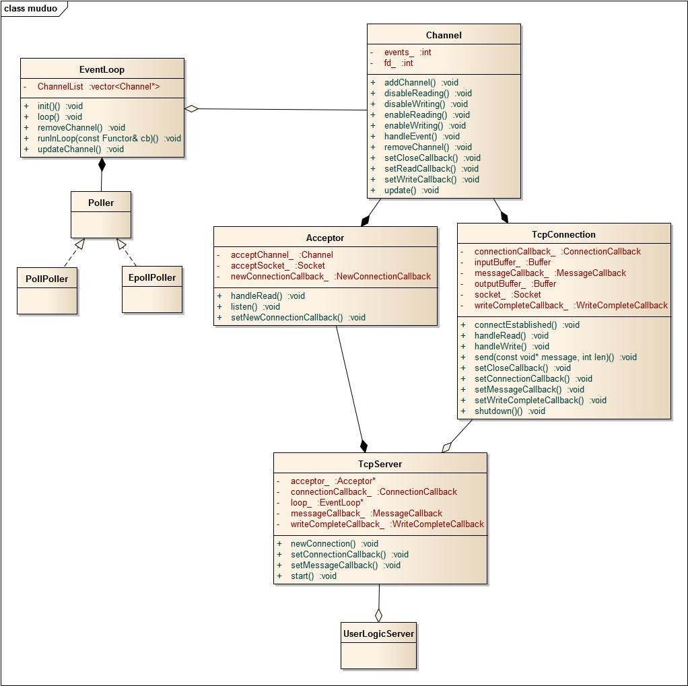

## tinywebserver

本项目分三部分
- 首先实现一个线程池`ThreadPool`
- 其次实现网络库`NetLib`
- 最后实现上层的`httpwebserver`

#### 0 项目描述

- 利用 epoll 和 `线程池`实现多线程的 Reactor 高并发模型；
- 利用标准容器封装 char, 实现缓冲区的自动增长
- 基于单例模式与阻塞队列实现异步的日志系统


其他项目

- [衍生项目, 剖析muduo源码(未做)]()
- [设计模式](https://github.com/li54426/Design_patterns_cpp)
- [STL笔记](https://github.com/li54426/STL_Notes)
- [c内存管理]()


[note: ] 不到100行的代码就只有一个`.h`文件, 就直接在头文件中实现
[note2: ]只有.h 文件，没有.cc 文件，cmake 默认忽略么, 所以上一条忽略. 因此添加了一个章节 声明和定义分离的好处


[TOC]


### 12 自顶向下解析调用过程

设置了这么多的回调函数, 一定头晕了吧, 现在让我们自顶向下梳理以下设置回调的过程


我们首先要清楚, 从服务器的角度来看, 我们需要**处理的事件**分为两类

- 一类是**连接建立**
- 另一类是 对建立的连接进行**读写**操作, 一般是先来后写

这就是`muduo`库的逻辑, 我们需要将这两类事情(连接, 消息)分别注册到不同的实体上, 一个是将`onConnection`注册到连接类`Acceptor`, 另一个是将`onMessage`注册到文件类`Channel`


在类图中 我们可以看出, 库是一个三层的结构

- 最高层, `tcpserver`层
- 中间层, `tcpconntion`层
- 最底层, `channel`层


#### 连接建立的回调函数

- 做的动作是, 创建一个 `tcpconn`对象, `tcpconn`对象中再创建`channel`
- 这个过程横跨了三层, 这就是回调函数的**意义**所在, 某个`channel`的回调函数居然能使用 `tcpserver`的函数, 从底下向上一层一层调用
    - 在`Channel::handleEventWithGuard`, 根据发生的时间, 执行不同的回调函数, 新连接建立时执行的是, `Acceptor::handleRead`
    -  `Acceptor::handleRead`将请求连接的 `sockfd`以及`peerAddr`保存下来, 传入上层的`tcpserver`
    - 在`tcpserver`中 创建 `tcpconn`对象, 再调用 `tcpconn`对象的函数, 设置`tcpconn`

```c++
// 根据事件 来调用回调函数
void Channel::handleEventWithGuard(Timestamp receiveTime){
  if ((revents_ & POLLHUP) && !(revents_ & POLLIN)) {
    if (closeCallback_) closeCallback_();
  }

  if (revents_ & POLLNVAL) {
    LOG_WARN << "fd = " << fd_ << " Channel::handle_event() POLLNVAL";
  }

  if (revents_ & (POLLERR | POLLNVAL)) {
    if (errorCallback_) errorCallback_();
  }
  if (revents_ & (POLLIN | POLLPRI | POLLRDHUP)){
    if (readCallback_) readCallback_(receiveTime);
  }
  if (revents_ & POLLOUT){
    if (writeCallback_) writeCallback_();
  }
  eventHandling_ = false;
}

// channel 的回调函数来自哪里呢
// 来自 acceptor的设置 自己 handleread
Acceptor::Acceptor(){
  acceptChannel_.setReadCallback(std::bind(&Acceptor::handleRead, this));
}

// 在 handleread 中, 调用了 传入的回调函数 newConnectionCallback_
void Acceptor::handleRead(){
  InetAddress peerAddr;
  //FIXME loop until no more
  int connfd = acceptSocket_.accept(&peerAddr);
  if (connfd >= 0){
    if (newConnectionCallback_){
      newConnectionCallback_(connfd, peerAddr);
    }
    else {
      sockets::close(connfd);
    }
  }
  else

}

// newConnectionCallback_来自哪里呢
// 该回调设置再tcpserver的构造函数中, 也就是说, 最终回调的是 TcpServer::newConnection 函数
acceptor_->setNewConnectionCallback(std::bind(&TcpServer::newConnection, this, _1, _2));

void TcpServer::newConnection(int sockfd, const InetAddress& peerAddr){
    // 建立连接, 即 tcpconn 对象
  InetAddress localAddr(sockets::getLocalAddr(sockfd));
  TcpConnectionPtr conn(new TcpConnection(ioLoop, connName, sockfd, localAddr, peerAddr));
  conn->setConnectionCallback(connectionCallback_);
  conn->setMessageCallback(messageCallback_);
  conn->setWriteCompleteCallback(writeCompleteCallback_);
  conn->setCloseCallback( std::bind(&TcpServer::removeConnection, this, _1)); // FIXME: unsafe

    // 运行连接函数
    ioLoop->runInLoop(std::bind(&TcpConnection::connectEstablished, conn));
}

void TcpConnection::connectEstablished(){
  // 设置 channel , 进行绑定等
  channel_->tie(shared_from_this());
   // 调用用户设置的回调函数
  connectionCallback_(shared_from_this());
}
```


再回过头去看设置的回调函数 `   void onConnection(const TcpConnectionPtr& conn) `, 就知道为什么回调函数的参数类型是这样


#### 发生事件的回调过程

- 发生读写事件的回调过程明显比建立连接的回调容易得多
    - channel 根据事件类型, 分发事件
    - 

```c++
// 根据事件 来调用回调函数
void Channel::handleEventWithGuard(Timestamp receiveTime){
  if ((revents_ & POLLHUP) && !(revents_ & POLLIN)) {
    if (closeCallback_) closeCallback_();
  }

  if (revents_ & POLLNVAL) {
    LOG_WARN << "fd = " << fd_ << " Channel::handle_event() POLLNVAL";
  }
}


// 这个回调函数是谁设置的呢, 是channel 的上层, tcpconn
TcpConnection::TcpConnection(){
  channel_->setReadCallback(std::bind(&TcpConnection::handleRead, this, _1));
  channel_->setWriteCallback(std::bind(&TcpConnection::handleWrite, this));
  channel_->setCloseCallback(std::bind(&TcpConnection::handleClose, this));
  channel_->setErrorCallback(std::bind(&TcpConnection::handleError, this));
}

void TcpConnection::handleRead(Timestamp receiveTime){
  loop_->assertInLoopThread();
  int savedErrno = 0;
  ssize_t n = inputBuffer_.readFd(channel_->fd(), &savedErrno);
  if (n > 0)
  {
    messageCallback_(shared_from_this(), &inputBuffer_, receiveTime);
  }
// .....
}


void TcpConnection::handleWrite()
{
  loop_->assertInLoopThread();
  if (channel_->isWriting())
  {
    ssize_t n = sockets::write(channel_->fd(),
                               outputBuffer_.peek(),
                               outputBuffer_.readableBytes());
    if (n > 0)
    {
      outputBuffer_.retrieve(n);
      if (outputBuffer_.readableBytes() == 0)
      {
        channel_->disableWriting();
        if (writeCompleteCallback_)
        {
          loop_->queueInLoop(std::bind(writeCompleteCallback_, shared_from_this()));
        }
      }
    }
  }
    // .....
}
      
// tcpconn的回调函数是谁设置的呢, 实在tcpserver::中
void TcpServer::newConnection(int sockfd, const InetAddress& peerAddr){
    // 建立连接, 即 tcpconn 对象
  InetAddress localAddr(sockets::getLocalAddr(sockfd));
  TcpConnectionPtr conn(new TcpConnection(ioLoop, connName, sockfd, localAddr, peerAddr));
  conn->setConnectionCallback(connectionCallback_);
  conn->setMessageCallback(messageCallback_);
  conn->setWriteCompleteCallback(writeCompleteCallback_);
  conn->setCloseCallback( std::bind(&TcpServer::removeConnection, this, _1)); // FIXME: unsafe

    // 运行连接函数
    ioLoop->runInLoop(std::bind(&TcpConnection::connectEstablished, conn));
}


        
```


#### 回调函数类型概览

```c++
// callbacks.h
typedef std::shared_ptr<TcpConnection> TcpConnectionPtr;
typedef std::function<void()> TimerCallback;
typedef std::function<void (const TcpConnectionPtr&)> ConnectionCallback;
typedef std::function<void (const TcpConnectionPtr&)> CloseCallback;
typedef std::function<void (const TcpConnectionPtr&)> WriteCompleteCallback;
typedef std::function<void (const TcpConnectionPtr&, size_t)> HighWaterMarkCallback;

typedef std::function<void (const TcpConnectionPtr&,
                            Buffer*,
                            Timestamp)> MessageCallback;
```


### 1 不可不知道的二三事情

如果在源码中有不懂得地方, 会用以下方式注释

```c++
// ###################[Question]#######################
```


#### 0 什么是回调函数

本文在自己手写的 muduo 类的基础上, 来剖析muduo的源码, 不完全是muduo的源代码, 但是**核心逻辑**是一样的

**自底向上**来剖析`muduo`库


从面向对象的角度来理解回调函数

当我们使用标准库时, 就接受过回调函数的概念

- 回调函数是一种编程概念，它是指在某个特定事件发生或条件满足时，由**另一个函数来调用的函数**。
- 简而言之，**回调函数是作为参数传递给其他函数的函数**。它可以通过函数指针、函数引用、委托或匿名函数等方式来传递。


#### 为什么设置回调函数需要 const ref

这个错误是因为在 TcpConnection 类中，setCloseCallback 函数的参数类型是非常量左值引用 CloseCallback&，而在 TcpServer 类的成员函数 newConnection 中使用了 std::bind 绑定函数时，生成了一个临时的右值 CloseCallback 对象，无法将其绑定到非常量左值引用参数上。


muduo 库中的线程池并不是传统意义上的线程池。muduo 库的线程池使用了一个线程池汇总器（ThreadPool），其中包含一个任务队列和一组线程，这些线程是动态增长和缩减的。当提交一个任务时，线程池会根据当前负载情况自动创建或销毁线程来执行任务，以充分利用系统资源。

线程池**实现**可以看`./thread_pool`文件夹


#### 1.1 eventfd

- `eventfd()` 是一个 Linux **系统调用**函数，用于创建一个事件文件描述符（event file descriptor）。它是一种进程间通信机制，用于在**不同的进程**之间传递事件通知。

```c++
#include <sys/eventfd.h>

// 创建并返回一个事件文件描述符
int eventfd(unsigned int initval, int flags);
// initval 是一个无符号整数，表示事件文件描述符的初始值。
// flags 是用于配置事件文件描述符的标志位。
```


`eventfd()` 函数的 `flags` 参数用于配置事件文件描述符的行为。下面列出了常用的 `flags` 标志位：

- `EFD_SEMAPHORE`：设置为此标志时，事件文件描述符的操作将以信号量模式进行，每次读取操作会减小计数器的值，每次写入操作会增加计数器的值。当计数器的值大于 0 时，读取操作将返回，并将计数器减小到 0。此标志可实现线程之间的同步。
- `EFD_NONBLOCK`：设置为此标志时，读取和写入操作将以非阻塞模式进行。如果没有事件或空间可用，读取操作将立即返回 0，写入操作将返回错误并设置 `EAGAIN` 错误码。
- `EFD_CLOEXEC`：设置为此标志时，在执行 `exec` 系列函数时，事件文件描述符将被关闭。这个标志通常会与 `O_CLOEXEC` 搭配使用，确保在创建子进程时事件文件描述符不会被继承。


####  1.2 errno

`errno` 是一个全局变量，在 C 和 C++ 中用于表示最近一次发生的系统调用错误代码。它位于 `<errno.h>` 头文件中，并且通过调用 `<cerrno>` 头文件中的 `errno` 宏来使用。

当系统调用（如打开文件、读取数据、创建进程等）发生错误时，操作系统会将相应的错误代码存储在 `errno` 变量中。这使得程序能够检测和处理发生的错误，以便采取适当的措施。

以下是使用 `errno` 时的常见用法：

1. 在系统调用失败后，可以使用 `errno` 的值来判断错误的类型。例如，如果 `errno` 的值为 `EACCES`，表示权限不足；如果值为 `ENOENT`，表示文件或目录不存在。

2. 可以使用 `perror()` 函数打印与 `errno` 相对应的错误消息。该函数会自动根据 `errno` 的值输出相应的错误消息，并附加自定义的错误描述。示例代码如下：

    ```
    cpp复制代码#include <cstdio>
    #include <cstring>
    #include <cerrno>
    
    int main() {
      FILE* file = fopen("nonexistent.txt", "r");
      if (file == nullptr) {
        perror("Failed to open file");
      }
      return 0;
    }
    ```

    输出：`Failed to open file: No such file or directory`

3. `strerror()` 函数可以将特定错误码转换为对应的错误消息字符串。示例代码如下：

    ```
    cpp复制代码#include <cstdio>
    #include <cstring>
    #include <cerrno>
    
    int main() {
      errno = ENOENT;
      printf("Error message: %s\n", strerror(errno));
      return 0;
    }
    ```

    输出：`Error message: No such file or directory`

需要注意的是，每次发生系统调用错误后，`errno` 的值会被设置为相应的错误代码，但它的值在其他操作或函数调用之后是不确定的，因此，在进行错误处理之前，必须立即检查和使用 `errno` 的值。此外，`errno` 的值在多线程环境下是线程安全的，每个线程都有自己的 `errno` 副本。


#### 1.3 引用

- 不可以对引用使用取地址操作符 `&`。在 C++ 中，对引用使用取地址操作符是非法的。
- 引用本身就是一个别名，它指向已存在的变量或对象。因此，没有必要去获取引用的地址，因为引用本身就是原变量的地址。


#### 1.4 class 与 c api 的问题

- 有些 `c-api`需要使用 变量的地址, 例如

```c++
// 函数原型
int bind(int sockfd, const struct sockaddr *addr, socklen_t addrlen);
```

解决办法

- 提供公开访问的**地址的函数**
- **类内**实现封装

```c++
// 提供公开访问的地址的函数
class MyClass {
private:
    int myVariable;

public:
    int* getMyVariableAddress() {
        return &myVariable;
    }
};


// 类内实现封装
class MyClass {
private:
    int myVariable;

public:
    void callCAPIFunction() {
        // 使用成员变量
        int result = someCAPIFunction(&myVariable);
        // 进一步处理结果
    }
};
```


#### 1.5 循环包含

在代码中同时包含`#include "eventloop.h"` 和 `class EventLoop;` 是为了解决循环包含的问题（circular dependency）。

循环包含指的是两个或多个头文件相互包含对方的情况，例如，**A 头文件包含 B 头文件，而 B 头文件又包含 A 头文件**。这种情况可能会导致编译错误或意想不到的行为。

为了解决循环包含的问题，我们可以使用前置声明（forward declaration）。`class EventLoop;` 是一种前置声明，它告诉编译器 `EventLoop` 这个类的存在，但不需要包含完整的定义。这样做可以避免循环包含的问题。

然而，在有些情况下，我们仍然需要包含完整的头文件来使用该类，因此我们同时包含`#include "eventloop.h"` 以确保完整的定义可用。

综上所述，`#include "eventloop.h"` 用于在需要使用 `EventLoop` 类的地方包含完整的定义，而 `class EventLoop;` 用于解决循环包含的问题。


#### 1.6 重定义问题

对于静态成员函数的定义，确实可能出现重定义问题。如果将静态成员函数的定义放在头文件中，并且多个源文件包含了该头文件，那么在链接阶段就会出现静态成员函数的重定义错误。

为了解决这个问题，一种常见的做法是将静态成员函数的声明放在头文件中，而将定义放在单独的 `.cc` 文件中。这样，在每个源文件中包含头文件时，只会得到静态成员函数的声明，而不会导致重定义错误。

例如，可以将静态成员函数的声明放在 `.h` 文件中：

```cpp
// MyClass.h

class MyClass {
public:
    static void myStaticFunction();
};
```

然后，在单独的 `.cc` 文件中提供静态成员函数的定义：

```cpp
// MyClass.cc

#include "MyClass.h"

void MyClass::myStaticFunction() {
    // 静态成员函数的实现代码
}
```

这样，在需要使用静态成员函数的源文件中，只需要包含 `"MyClass.h"` 头文件即可，而不会出现重定义问题。

注意，在使用静态成员函数之前，需要先编译并链接对应的 `.cc` 文件，以确保静态成员函数的定义被正确地链接到最终的可执行文件中。


#### 1.7 `reinterpret_cast` 

`reinterpret_cast` 是 C++ 中的一种类型转换运算符，用于处理不同类型之间的指针或引用的转换。它可以将一个指针或引用转换为与其完全不相关的另一个类型，即重新解释该内存中的位模式。

`reinterpret_cast` 的语法如下：

```
cpp复制代码reinterpret_cast<目标类型>(表达式)
```

- `目标类型`：要转换成的类型。
- `表达式`：要进行转换的指针、引用或算术表达式。

使用 `reinterpret_cast` 时需要注意以下几点：

1. `reinterpret_cast` 可以在不同类型之间进行任意的直接位模式转换，包括指针、引用和算术类型。它主要用于处理底层的系统级别操作，例如将一个整型指针转换为一个字符型指针。
2. `reinterpret_cast` 是非常危险的，因为它会忽略类型之间的任何语义和检查。因此，应该谨慎使用，并确保转换是正确和安全的。
3. 并非所有的转换都是合法的或有意义的。不能将指针或引用转换为无关类型，除非你非常了解程序的底层细节并且确定转换是有效的。
4. `reinterpret_cast` 不能用于转换多态类型（即具有虚函数的类类型），这应该使用 `dynamic_cast`。

总之，`reinterpret_cast` 允许你在不同类型之间进行位模式的重新解释，并且可以处理指针、引用和算术类型之间的转换。但是要注意，使用 `reinterpret_cast` 需要非常小心，确保转换是正确和安全的，并且只在必要的情况下使用它。在大多数情况下，应该优先考虑使用其他更安全的类型转换运算符，如 `static_cast` 或 `dynamic_cast`。


源码分析

- 在设计 IP地址类, `InetAddress`类时, 因为要 调用 bind 时需要指针类型, 让我们看看源码是如何解决的该问题

```c++
// bind函数原型 如下
int bind(int sockfd, const struct sockaddr *addr, socklen_t addrlen);

const struct sockaddr* InetAddress::getSockAddr() const { return sockets::sockaddr_cast(&addr_); }
const struct sockaddr* sockets::sockaddr_cast(const struct sockaddr_in6* addr)
{
  return static_cast<const struct sockaddr*>(implicit_cast<const void*>(addr));
}

struct sockaddr* sockets::sockaddr_cast(struct sockaddr_in6* addr)
{
  return static_cast<struct sockaddr*>(implicit_cast<void*>(addr));
}
```


#### 1.8 union

- 在 C++ 中，union 是一种特殊的数据结构，它允许在相同的内存位置存储不同的数据类型。这意味着同一块内存可以用于存储多个不同类型的变量，但每次只能使用其中一个。
- union 内存的大小取决于最大成员的大小，因此要确保所有成员都可以适应该大小。
- union 不能包含引用类型、带有构造函数或析构函数的类类型。

```c++
union MyUnion {
    int x;
    float y;
    char z;
};


MyUnion u;
u.x = 10;   // 使用 x 成员写入数据
std::cout << u.x << std::endl;   // 读取 x 成员的值
u.y = 3.14f;  // 使用 y 成员写入数据
std::cout << u.y << std::endl;   // 读取 y 成员的值
```


#### 1.9 编译器宏: \__FILE__

`__FILE__` 是一个预定义的宏，用于获取当前源文件的文件名。它是在编译时由编译器替换为当前源文件的字符串常量，包括文件的完整路径（如果提供了完整路径）。


```c++
//-----------[example.h]---------
#ifndef EXAMPLE_H
#define EXAMPLE_H

#include <iostream>

void printFileName() {
    std::cout << "当前文件名：" << __FILE__ << std::endl;
}

#endif // EXAMPLE_H

// --------------[test.cc]--------
#include "example.h"

int main() {
    printFileName();
    return 0;
}

//# 当前文件名：example.h
```

`__FILE__` 宏在调试和日志记录等场景中非常有用，可以帮助开发人员追踪问题或确定正在操作的文件。


```c++
#include <iostream>

void example() {
    std::cout << "当前函数名：" << __FUNCTION__ << std::endl;
}

int main() {
    example();
    return 0;
}
// # 当前函数名：example
```


#### 1.10 __builtin_expect()

`__builtin_expect()` 是 GCC（GNU Compiler Collection）提供的一种优化指令，用于给编译器提供分支预测信息，以便优化代码的执行性能。

在程序中，经常会有条件判断语句（如 if、switch 等），根据条件的成立与否，程序会选择不同的执行路径。但是，由于条件的结果通常是不确定的，编译器无法事先知道哪个执行路径更有可能发生。这就会导致处理器的分支预测（Branch Prediction）功能无法发挥最佳效果，从而影响程序的性能。

`__builtin_expect()` 函数可以告诉编译器，某个条件的发生是高度可能的（或低度可能的），以便编译器根据这个信息进行优化。函数的原型如下：

```c++
long __builtin_expect(long exp, long c)
```

其中 `exp` 是表达式，表示某个条件的结果；`c` 是期望的结果（通常是一个常量）。函数的返回值是表达式 `exp` 的结果。

具体来说，`__builtin_expect()` 函数的作用如下：

1. 告诉编译器某个条件发生的概率：通过将 `exp` 设为一个条件表达式，并将 `c` 设置为条件为真的概率，可以向编译器传递条件发生的期望概率。例如，`__builtin_expect((x > 0), 1)` 表示条件 `x > 0` 的发生概率很高。
2. 优化分支预测：编译器会根据 `__builtin_expect()` 提供的信息，对条件判断进行预测优化。通常，编译器会假设期望值为真的路径更有可能发生，采取对应的优化措施，如提前加载相关数据、预取数据等。这样可以提高处理器的分支预测命中率，从而提高程序的性能。

需要注意的是，`__builtin_expect()` 并不改变实际的条件结果，它只是给编译器提供了一种优化提示。因此，在使用该函数时，要确保期望值的选择合理，符合实际情况，以获得最佳的优化效果。

总之，`__builtin_expect()` 是 GCC 提供的一种优化指令，用于给编译器提供条件表达式的期望结果，以便优化分支预测，提高程序的执行性能。


#### 1.11 `extern __thread int t_cachedTid;` 

这是一条 C/C++ 代码声明语句，用于声明一个具有线程局部存储（Thread Local Storage，TLS）特性的整数类型变量 `t_cachedTid`。

让我们来解释每个关键部分的含义：

- `extern` 关键字：在这个上下文中，`extern` 用于告诉编译器该变量是在其他地方定义的，并且需要在当前文件中进行引用。这样做是为了防止多个源文件中重复定义同一个变量。
- `__thread` 关键字：这是一个 GCC 提供的扩展关键字，用于声明**线程局部存储**（Thread Local Storage）。使用 `__thread` 关键字声明的变量，每个线程都拥有一份独立的副本。换句话说，每个线程都有自己的 `t_cachedTid` 变量，互不干扰。
- `int` 类型：表示 `t_cachedTid` 是一个整数类型的变量，可以存储整数值。
- `t_cachedTid`：这是变量的名称，可以根据实际需求进行命名。

综合起来，`extern __thread int t_cachedTid;` 的意思是，在当前文件中声明了一个具有线程局部存储特性的整数类型变量 `t_cachedTid`。每个线程都会有自己的 `t_cachedTid` 变量，而不会相互影响。这种声明常用于多线程编程中，以提供每个线程独立的存储空间，避免数据竞争和线程间冲突。


#### 1.12 GUARDED_BY(mutex_)

`GUARDED_BY(mutex_)` 是 Google C++ 编程规范中的一个注解（Annotation），用于指示在多线程环境下某个变量需要受到互斥锁的保护。

这个注解的语法形式是 `GUARDED_BY(mutex_)`，其中 `mutex_` 是一个互斥锁（或类似的同步原语）。

当一个变量被标记为 `GUARDED_BY(mutex_)` 时，意味着在访问或修改该变量之前，必须先获取与 `mutex_` 关联的互斥锁（通常是通过加锁操作），否则存在数据竞争和并发访问的风险。而在释放锁之后，其他线程才能够安全地访问该变量。

使用 `GUARDED_BY(mutex_)` 注解可以帮助开发者更好地理解和识别在多线程环境中哪些变量需要进行同步保护，从而减少并发错误和数据竞争的可能性。此外，一些工具和静态分析器也可以利用这些注解来进行静态检查，帮助发现潜在的多线程问题。


### 2 muduo 概览

[Note]  1.2- 1.5都来自陈硕大大的书中


#### 2.1 类图


- 最高层次的类只有两个`EventLoop`以及 `TcpServer`
- `EventLoop`管理着 `Poller`以及一个channel
- `TcpServer`管理着 `Acceptor`以及`TcpConnection`


####  2.2 TcpServer::start ()做了什么

在 muduo 库中，`server.start()` 是用于启动 `TcpServer` 服务器的方法。当调用 `server.start()` 时，服务器将开始监听指定的地址和端口，并准备接受客户端的连接。

具体而言，`server.start()` 会执行以下操作：

1. 创建一个 `Acceptor` 对象，用于监听指定的地址和端口。
2. 创建一个 `EventLoopThreadPool` 对象，用于管理事件循环线程池。
3. 注册一个回调函数，当有新的连接建立时，调用用户自定义的连接回调函数。
4. **启动** `EventLoopThreadPool` 中的所有**线程**，每个线程都会运行一个 `EventLoop` 事件循环。
5. `TcpServer` 开始监听，并等待客户端的连接请求。

通过调用 `server.start()`，服务器就能够启动并开始接受客户端的连接，以便与客户端进行通信。在 `start()` 方法被调用后，服务器会一直运行，直到程序结束或者调用 `server.stop()` 方法停止服务器的运行。


#### 2.3 EventLoop::loop() 做了什么

`EventLoop::loop` 是 muduo 库中 `EventLoop` 类的主要方法之一，它用于启动事件循环，监听和处理事件。

具体来说，`EventLoop::loop` 方法会执行以下操作：

1. 初始化：首先会进行一些初始化工作，例如设置当前线程 ID、创建轮询器 (Poller) 对象等。
2. 进入事件循环：进入一个**无限循环**，在循环中不断处理事件。循环的核心是调用轮询器的 `poll` 方法，监听文件描述符上的事件。
3. 事件分发：当有事件发生时（例如套接字收到新数据、连接关闭等），轮询器会返回事件的发生，`EventLoop` 会根据事件类型进行相应的处理。常见的事件类型包括可读事件、可写事件和错误事件。
4. 事件处理：根据不同的事件类型，`EventLoop` 会调用相应的回调函数进行事件处理。例如，对于可读事件，会调用注册的读事件回调函数；对于可写事件，会调用注册的写事件回调函数。这些回调函数一般由用户提供，用于实现自定义的业务逻辑。
5. 定时器处理：在事件循环中还会处理定时器的超时事件。`EventLoop` 维护了一个定时器队列，会检查定时器是否到期，并触发相应的定时器回调函数。
6. 退出事件循环：当满足退出条件时，通过调用 `quit` 方法或其他方式，可以使事件循环退出，结束 `loop` 方法的执行。

总而言之，`EventLoop::loop` 方法是 muduo 库中实现事件循环的关键部分。它负责监听和处理事件，包括读写事件、错误事件和定时器事件等。通过使用 `loop` 方法，可以实现异步、事件驱动的编程模型，提高服务器性能和并发处理能力。


#### 2.4 公开接口

- Buffer仿Netty ChannelBuffer的buffer class，数据的读写通过buffer进行。用户代码不需要调用read(2)/write(2)，只需要处理收到的数据和准备好要发送的数据（§7.4）。
- InetAddress封装IPv4地址（end point），注意，它不能解析域名，只认IP地址。因为直接用gethostbyname(3)解析域名会阻塞IO线程。
- EventLoop事件循环（反应器Reactor），每个线程只能有一个EventLoop实体，它负责IO和定时器事件的分派。它用eventfd(2)来异步唤醒，这有别于传统的用一对pipe(2)的办法。它用TimerQueue作为计时器管理，用Poller作为IO multiplexing。
- EventLoopThread启动一个线程，在其中运行EventLoop::loop()。
- TcpConnection整个网络库的核心，封装一次TCP连接，注意它不能发起连接。
- TcpClient用于编写网络客户端，能发起连接，并且有重试功能。
- TcpServer用于编写网络服务器，接受客户的连接。


#### 2.5 生命周期

- 在这些类中，TcpConnection的生命期依靠shared_ptr管理（即用户和库共同控制）。
- Buffer的生命期由TcpConnection控制。其余类的生命期由用户控制。
- Buffer和InetAddress具有值语义，可以拷贝；其他class都是对象语义，不可以拷贝。


#### 2.6 内部实现

- Channel是selectable IO channel，负责注册与响应IO事件，注意它不拥有filedescriptor。它是Acceptor、Connector、EventLoop、TimerQueue、TcpConnection的成员，生命期由后者控制。
- Socket是一个RAIIhandle，封装一个filedescriptor，并在析构时关闭fd。它是Acceptor、TcpConnection的成员，生命期由后者控制。EventLoop、TimerQueue也拥有fd，但是不封装为Socket class。
- SocketsOps封装各种Sockets系统调用。
- Poller是PollPoller和EPollPoller的基类，采用“电平触发”的语意。它是EventLoop的成员，生命期由后者控制。
- PollPoller和EPollPoller封装poll(2)和epoll(4)两种IO multiplexing后端。poll的存在价值是便于调试，因为poll(2)调用是上下文无关的，用strace(1)很容易知道库的行为是否正确。
- Connector用于发起TCP连接，它是TcpClient的成员，生命期由后者控制。
- Acceptor用于接受TCP连接，它是TcpServer的成员，生命期由后者控制。
- TimerQueue用timerfd实现定时，这有别于传统的设置poll/epoll_wait的等待时长的办法。TimerQueue用std::map来管理Timer，常用操作的复杂度是O(logN)，N为定时器数目。它是EventLoop的成员，生命期由后者控制。
- EventLoopThreadPool用于创建IO线程池，用于把TcpConnection分派到某个EventLoop线程上。它是TcpServer的成员，生命期由后者控制。


#### 2.7 网络编程的本质论

我认为，TCP网络编程最本质的是处理三个半事件：

- 1．连接的建立，包括服务端接受（accept）新连接和客户端成功发起（connect）连接。TCP连接一旦建立，客户端和服务端是平等的，可以各自收发数据。
- 2．连接的断开，包括主动断开（close、shutdown）和被动断开（read(2)返回0）。
- 3．消息到达，文件描述符可读。这是最为重要的一个事件，对它的处理方式决定了网络编程的风格（阻塞还是非阻塞，如何处理**分包**，应用层的缓冲如何设计，等等）。
- 3.5 消息发送完毕，这算半个。对于低流量的服务，可以不必关心这个事件；另
    外，这里的“发送完毕”是指将数据写入操作系统的缓冲区，将由TCP协议栈负责数据的发
    送与重传，不代表对方已经收到数据。


Reactor 模式是一种用于构建高性能、可扩展的网络应用程序的设计模式。它通过将网络请求的处理分离成多个事件处理器，来实现并发和异步操作。Reactor 模式主要包括以下几个组成部分：

1. Reactor（反应器）：它是整个模式的**核心组件**，负责**监听和分发事件**。它**维护一个事件循环**，并在事件到达时将其分发给相应的事件处理器。Reactor 可以是单线程的，也可以是多线程的。
2. 事件处理器（Event Handler）：它负责**处理特定类型的事件**。在 Reactor 模式中，事件处理器通常是基于回调函数或者接口的，当事件发生时，Reactor 将事件分发给相应的事件处理器进行处理。
3. 事件（Event）：它是系统中发生的特定类型的事件，可以是网络连接的建立、数据到达等。每种类型的事件都有对应的事件处理器。
4. 事件源（Event Source）：它生成事件并将其传递给 Reactor 进行处理。事件源可以是网络套接字、文件描述符等。

Reactor 模式的工作流程如下：

1. Reactor 在事件循环中等待事件的到来。
2. 当事件到达时，Reactor 将其分发给相应的事件处理器。
3. 事件处理器执行事件处理逻辑，并可能触发其他事件。
4. 处理完事件后，事件处理器将控制权交还给 Reactor。
5. Reactor 检测是否有新的事件到达，如有，则重复上述步骤。

Reactor 模式的优势在于它提供了高度的可扩展性和并发性。通过使用非阻塞 I/O 和事件驱动的方式，它可以处理大量的并发连接，而无需为每个连接分配一个独立的线程。这减少了线程切换开销，提高了系统的吞吐量和响应性能。此外，Reactor 模式还可以方便地实现多线程的 Reactor，从而进一步提高并发处理能力。


### 3 muduo 库的使用


- 在进入本章的学习之前, 让我们熟悉一下`muduo`库的使用, 观察他的调用逻辑
- 创建了一个基于 muduo 库的简单 TCP 服务器。服务器在指定的地址和端口上监听连接，并打印新连接和**收到的消息**。
- 在这个`demo`中, 我们可以看出, 我们只需要重新设计`TcpServer::onConnection(const TcpConnectionPtr& conn) `以及`TcpServer::onMessage(const TcpConnectionPtr& conn, Buffer* buf, Timestamp time)`这两个函数. (实际上也可以不需要重新设计 `onConnection()`函数, 也能正常运行), 然后再使用 `set`方法绑定进去就可以了 
- 只要能保证函数类型固定, 也可以用 `lambda`表达式来设计, 甚至还可以用两个类**重载**`operator()`的方法


#### 3.1 类内函数( bind )版本

```c++
#include <muduo/net/EventLoop.h>
#include <muduo/net/TcpServer.h>
#include <iostream>

using namespace muduo;
using namespace muduo::net;

class MyServer {
public:
    MyServer(EventLoop* loop, const InetAddress& listenAddr)
        : server_(loop, listenAddr, "MyServer") {
        server_.setConnectionCallback(
            std::bind(&MyServer::onConnection, this, _1)
        );
        server_.setMessageCallback(
            std::bind(&MyServer::onMessage, this, _1, _2, _3)
        );
    }

    void start() {
        server_.start();
    }

private:
    void onConnection(const TcpConnectionPtr& conn) {
        if (conn->connected()) {
            std::cout << "New connection from "
                      << conn->peerAddress().toIpPort() << std::endl;
        } else {
            std::cout << "Connection " << conn->name()
                      << " is down" << std::endl;
        }
    }

    void onMessage(const TcpConnectionPtr& conn, Buffer* buf, Timestamp time) {
        std::string msg(buf->retrieveAllAsString());
        std::cout << "Received message from "
                  << conn->peerAddress().toIpPort()
                  << ": " << msg << std::endl;
        
        conn-> send(msg);
    }

    TcpServer server_;
};

int main() {
    EventLoop loop;
    InetAddress listenAddr(8888);
    MyServer server(&loop, listenAddr);

    server.start();
    loop.loop();

    return 0;
}

```


#### 3.2 以下是lambda表达式版本

```c++
// lambda表达式版本
class MyServer {
public:
    MyServer(EventLoop* loop, const InetAddress& listenAddr)
        : server_(loop, listenAddr, "MyServer") {
        server_.setConnectionCallback(
            [this](const TcpConnectionPtr& conn) {
                if (conn->connected()) {
                    std::cout << "New connection from "
                              << conn->peerAddress().toIpPort() << std::endl;
                } else {
                    std::cout << "Connection " << conn->name()
                              << " is down" << std::endl;
                }
            }
        );
        server_.setMessageCallback(
            [this](const TcpConnectionPtr& conn, Buffer* buf, Timestamp time) {
                std::string msg(buf->retrieveAllAsString());
                std::cout << "Received message from "
                          << conn->peerAddress().toIpPort()
                          << ": " << msg << std::endl;
            }
        );
    }

    void start() {
        server_.start();
    }

private:
    TcpServer server_;
};
```


#### 3.3 重载 `operator()`版本

```c++
class ConnectionCallback {
public:
    void operator()(const TcpConnectionPtr& conn) {
        if (conn->connected()) {
            std::cout << "New connection from "
                      << conn->peerAddress().toIpPort() << std::endl;
        } else {
            std::cout << "Connection " << conn->name()
                      << " is down" << std::endl;
        }
    }
};

class MessageCallback {
public:
    void operator()(const TcpConnectionPtr& conn, Buffer* buf, Timestamp time) {
        std::string msg(buf->retrieveAllAsString());
        std::cout << "Received message from "
                  << conn->peerAddress().toIpPort()
                  << ": " << msg << std::endl;
    }
};

class MyServer {
public:
    MyServer(EventLoop* loop, const InetAddress& listenAddr)
        : server_(loop, listenAddr, "MyServer") {
        server_.setConnectionCallback(ConnectionCallback());
        server_.setMessageCallback(MessageCallback());
    }

    void start() {
        server_.start();
    }

private:
    TcpServer server_;
};
```


#### 3.4 一个问题: 如何主动给客户端发消息

我们首先要明白:

- `using TcpConnectionPtr = std::shared_ptr<TcpConnection>;`

```c++
#include <muduo/net/EventLoop.h>
#include <muduo/net/TcpServer.h>
#include <iostream>

using namespace muduo;
using namespace muduo::net;

class MyServer {
public:
    MyServer(EventLoop* loop, const InetAddress& listenAddr)
        : server_(loop, listenAddr, "MyServer") {
        server_.setConnectionCallback(
            [this](const TcpConnectionPtr& conn) {
                if (conn->connected()) {
                    std::cout << "New connection from "
                              << conn->peerAddress().toIpPort() << std::endl;

                    // 发送信息到客户端
                    conn->send("Hello from server!\r\n");

                    // 添加连接到列表中
                    connections_.insert(conn);
                } else {
                    std::cout << "Connection " << conn->name()
                              << " is down" << std::endl;

                    // 从列表中移除连接
                    connections_.erase(conn);
                }
            }
        );
        server_.setMessageCallback(
            [this](const TcpConnectionPtr& conn, Buffer* buf, Timestamp time) {
                std::string msg(buf->retrieveAllAsString());
                std::cout << "Received message from "
                          << conn->peerAddress().toIpPort()
                          << ": " << msg << std::endl;

                // 收到消息后回复客户端
                conn->send("Received your message: " + msg);
            }
        );
    }

    void start() {
        server_.start();
    }

    void sendToAllClients(const std::string& message) {
        // 遍历所有连接，发送消息给每个客户端
        for (const auto& conn : connections_) {
            conn->send(message);
        }
    }

private:
    TcpServer server_;
    std::set<TcpConnectionPtr> connections_;
};

int main() {
    EventLoop loop;
    InetAddress listenAddr(8888);
    MyServer server(&loop, listenAddr);

    server.start();
    loop.loop();

    return 0;
}
```


### 4 Log 日志类 和  时间戳 以及 buffer 类

- 1 LogStream.cc 中 LogStream 作为 c++ 流式日志**输入**模块
- 2 Logging.cc 中 Logger 在 LogStream 基础上增加 loglevel，并在 Logger 析构时，通过提前设置的**回调函数**来导出 logStream 中保存的日志数据
- 3 logFile 是将内存中的数据写入文件中，并伴有**文件名称格式化**处理
- 4 AsyncLog 有两个功能：1）使用缓存队列存放 log，减少**写文件**频率 2）在**子线程**中使用 LogFile 将日志异步保存


#### 4.1 LogStrean---如何设计一个流类

- 成员只有缓冲区 `  Buffer buffer_;`
- 成员函数`self& operator<<(short);`各种类型的重载
- 做的操作只有 **类型转换** 以及加入缓冲区

```c++
class LogStream : noncopyable
{
  typedef LogStream self;
 public:
  typedef detail::FixedBuffer<detail::kSmallBuffer> Buffer;

  self& operator<<(bool v)
  {
    buffer_.append(v ? "1" : "0", 1);
    return *this;
  }

  self& operator<<(short);
  self& operator<<(unsigned short);
  self& operator<<(int);
  self& operator<<(unsigned int);
  self& operator<<(long);
  self& operator<<(unsigned long);
  self& operator<<(long long);
  self& operator<<(unsigned long long);

  self& operator<<(const void*);

  self& operator<<(float v)
  {
    *this << static_cast<double>(v);
    return *this;
  }
  self& operator<<(double);
  // self& operator<<(long double);

    // 具体的实现
  self& operator<<(char v)
  {
    buffer_.append(&v, 1);
    return *this;
  }

  // self& operator<<(signed char);
  // self& operator<<(unsigned char);

  self& operator<<(const char* str)
  {
    if (str)
    {
      buffer_.append(str, strlen(str));
    }
    else
    {
      buffer_.append("(null)", 6);
    }
    return *this;
  }

  self& operator<<(const unsigned char* str)
  {
    return operator<<(reinterpret_cast<const char*>(str));
  }

  self& operator<<(const string& v)
  {
    buffer_.append(v.c_str(), v.size());
    return *this;
  }

  self& operator<<(const StringPiece& v)
  {
    buffer_.append(v.data(), v.size());
    return *this;
  }

  self& operator<<(const Buffer& v)
  {
    *this << v.toStringPiece();
    return *this;
  }

  void append(const char* data, int len) { buffer_.append(data, len); }
  const Buffer& buffer() const { return buffer_; }
  void resetBuffer() { buffer_.reset(); }

 private:
  void staticCheck();

  template<typename T>
  void formatInteger(T);

  Buffer buffer_;

  static const int kMaxNumericSize = 48;
};

```


以下是如何整数类型如何转换, 但是感觉 `to_string()`也不错啊

```c++
template<typename T>
void LogStream::formatInteger(T v)
{
  if (buffer_.avail() >= kMaxNumericSize)
  {
    size_t len = convert(buffer_.current(), v);
    buffer_.add(len);
  }
}

template<typename T>
size_t convert(char buf[], T value)
{
  T i = value;
  char* p = buf;

  do
  {
    int lsd = static_cast<int>(i % 10);
    i /= 10;
    *p++ = zero[lsd];
  } while (i != 0);

  if (value < 0)
  {
    *p++ = '-';
  }
  *p = '\0';
  std::reverse(buf, p);

  return p - buf;
}
```


#### 4.2 timestamp 类

timestamp 类 是一个和时间相关的类

```c++
#ifndef TIMESTAMP_H
#define TIMESTAMP_H


#include<time.h>
// 为了 int64_t
#include<cstdint>
#include<string>
using std::string;
#include<unistd.h>
class Timestamp{
public:
    explicit Timestamp(int64_t micro_seconds_since_epoch = 0):
        micro_seconds_since_epoch_(micro_seconds_since_epoch){}

    void swap();
    string toString()const;
    string toFormattedString()const;

    static Timestamp now();


    inline bool operator<(Timestamp rhs){
        return micro_seconds_since_epoch_< rhs.micro_seconds_since_epoch_;
    }
    inline bool operator==(Timestamp rhs){
        return micro_seconds_since_epoch_== rhs.micro_seconds_since_epoch_;
    }
private:
    int64_t micro_seconds_since_epoch_;

};

Timestamp Timestamp :: now(){
    time_t t = time(NULL);
    return Timestamp(t);
}

string Timestamp ::toString()const{
    time_t t = time(nullptr);
    char buf[64]={};
    tm* tm_time = localtime(&t);
    snprintf(buf, 64, "%4d/%02d/%02d %02d:%02d:%02d", 
        tm_time->tm_year+ 1900, tm_time->tm_mon+1, tm_time-> tm_mday, 
        tm_time-> tm_hour, tm_time->tm_min, tm_time->tm_sec);
    return string(buf);
}

#endif
```


####  4.3 buffer类

- 每个连接都有着自己的缓冲区, 因此 **不用考虑多线程**的问题
- 对外表现为一块**连续的内存** (char*, len)，以方便客户代码的编写。
- 其 size () 可以**自动增长**，以适应不同大小的消息。它不是一个 fixed size array (即 char buf [8192])。
- 内部以 vector of char 来保存数据，并提供相应的访问函数。

buffer 分为三部分 prependable、readable、writable

- readid : 从哪里开始读
- writeid : 从哪开始写(还没写)


接口如下

```c++
/// A buffer class modeled after org.jboss.netty.buffer.ChannelBuffer
///
/// @code
/// +-------------------+------------------+------------------+
/// | prependable bytes |  readable bytes  |  writable bytes  |
/// |                   |     (CONTENT)    |                  |
/// +-------------------+------------------+------------------+
/// |                   |                  |                  |
/// 0      <=      readerIndex   <=   writerIndex    <=     size
/// @endcode
class Buffer : public muduo::copyable
{
 public:
  static const size_t kCheapPrepend = 8;
  static const size_t kInitialSize = 1024;

  explicit Buffer(size_t initialSize = kInitialSize)
    : buffer_(kCheapPrepend + initialSize),
      readerIndex_(kCheapPrepend),
      writerIndex_(kCheapPrepend)
  {
    assert(readableBytes() == 0);
    assert(writableBytes() == initialSize);
    assert(prependableBytes() == kCheapPrepend);
  }

  // implicit copy-ctor, move-ctor, dtor and assignment are fine
  // NOTE: implicit move-ctor is added in g++ 4.6

  void swap(Buffer& rhs);

  size_t readableBytes() const;
  size_t writableBytes() const;
  size_t prependableBytes() const;

    // 开始读的地方
  const char* peek() const;

  // 手动输入读出了多少字节
  void retrieve(size_t len);
  void retrieveAll();

// 将buffer中的内容输出为 string
  string retrieveAsString(size_t len);

  void append(const StringPiece& str);
  void append(const char* /*restrict*/ data, size_t len);
  void append(const void* /*restrict*/ data, size_t len);

    // 确保能写入这么 n 字节
  void ensureWritableBytes(size_t len)

  char* beginWrite();
  const char* beginWrite() const;

// 手动输入写入了多少字节
  void hasWritten(size_t len);

  /// Read data directly into buffer.
  ///
  /// It may implement with readv(2)
  /// @return result of read(2), @c errno is saved
  ssize_t readFd(int fd, int* savedErrno);

 private:

  char* begin()
  { return &*buffer_.begin(); }

  const char* begin() const
  { return &*buffer_.begin(); }

  void makeSpace(size_t len)
  {
    if (writableBytes() + prependableBytes() < len + kCheapPrepend)
    {
      // FIXME: move readable data
      buffer_.resize(writerIndex_+len);
    }
    else
    {
      // move readable data to the front, make space inside buffer
      assert(kCheapPrepend < readerIndex_);
      size_t readable = readableBytes();
      std::copy(begin()+readerIndex_,
                begin()+writerIndex_,
                begin()+kCheapPrepend);
      readerIndex_ = kCheapPrepend;
      writerIndex_ = readerIndex_ + readable;
      assert(readable == readableBytes());
    }
  }

 private:
  std::vector<char> buffer_;
  size_t readerIndex_;
  size_t writerIndex_;

  static const char kCRLF[];
};


#endif  // MUDUO_NET_BUFFER_H

```


### 5 socket 相关的封装类


首先, 回忆一下如何创建 **socket**, 进行通信

```c++
sock = socket(PF_INET, SOCK_STREAM, 0);
if (sock == -1)
    error_handling("socket() error");

struct sockaddr_in serv_addr;
memset(&serv_addr, 0, sizeof(serv_addr));
serv_addr.sin_family = AF_INET;
serv_addr.sin_addr.s_addr = inet_addr(argv[1]);
serv_addr.sin_port = htons(atoi(argv[2]));

connect(sock, (struct sockaddr *)&serv_addr, sizeof(serv_addr));
```


可以看出, 我们创建的**socket** 必须匹配  serv_addr.sin_family, 那么 `AF_INET` 和 `PF_INET` 有什么区别和联系呢

`PF_INET` 和 `AF_INET` 是网络编程中用于表示 IPv4 地址族的常量，它们在功能上没有区别，可以互换使用。

- `AF_INET`（Address Family Internet）：这是一个地址族的常量，用于表示 IPv4 地址族。它的命名来自于网络协议栈中的 "Internet Layer"（因特网层），表示支持 IPv4 的网络地址。
- `PF_INET`（Protocol Family Internet）：这是一个协议族的常量，也用于表示 IPv4 地址族。它的命名来自于网络协议栈中的 "Internet Protocol Suite"（因特网协议套件），表示支持 IPv4 的协议集合。

也就是说, 当我们创建 socket/ sockaddr_in 时, 下面两种形式是等价的

```c++
int sockfd = socket(AF_INET, SOCK_STREAM, 0);
// 或
int sockfd = socket(PF_INET, SOCK_STREAM, 0);

struct sockaddr_in serverAddress;
serverAddress.sin_family = AF_INET;
// 或
serverAddress.sin_family = PF_INET;
```


在muduo的代码中, 创建 socket时, 传进去的是 `sockaddr_in`协议族

```c++
// SocketsOps.h
int createNonblockingOrDie(sa_family_t family);
```


#### 5.1 InetAddress

- 为了减少繁琐 **地址转换** 的操作, 提供简单易用的 classs 的 api, 不需要频繁的传入地址的操作, 对 sockaddr_in 进行封装
- 没有什么难点, 两个要点就在于
    - **端口**的字节序的转换 
    - string类型的ip地址转换为 addr 类型
- 因为要将 addr 传入 socket 中, 因此要考虑保持这种**兼容**

```c++
#ifndef INETADDR
#define INETADDR

#include<netinet/in.h>
#include<arpa/inet.h>
#include<string>

#include<cstring>
using std::string;

#include<iostream>
class InetAddress{
public:
    explicit InetAddress(int port, string ip = "127.0.0.1");
    explicit InetAddress(InetAddress &) = default;
	
    // 因为要将 addr 传入 socket中, 因此要考虑保持这种兼容
    // socket 需要的是地址
    struct sockaddr * getSockAddr();
    string toIp() const;
    string toIpPort()const;
    string toPort()const;

    void setSockAddr(sockaddr_in );

private:
    sockaddr_in addr_;
};
InetAddress:: InetAddress(int port, string ip){
    // std::cout<<ip<<'\n';
    memset(&addr_, 0, sizeof(addr_));
    // 初始化 addr_, 三个 sin
    // 字符串 和 int 都要经过函数转换
    addr_.sin_family = AF_INET;
    addr_.sin_addr.s_addr = inet_addr(ip.c_str());
    addr_.sin_port = htons(port);

}

string InetAddress::toIp() const{
    char buff[64] ={};
    inet_ntop(AF_INET, &addr_.sin_addr, buff, sizeof(buff));
    return buff;
}
string InetAddress::toIpPort()const{
    char buff[64] ={};
    inet_ntop(AF_INET, &addr_.sin_addr, buff, sizeof(buff));
    int len = strlen(buff);
    int port =  ntohs(addr_.sin_port);
    sprintf(buff + len, ":%u", port);
    return buff;


}
string InetAddress::toPort()const{
    char buff[64];
    int a = ntohs(addr_.sin_port);
    return std::to_string(a);
}

struct sockaddr * InetAddress::getSockAddr(){
    return reinterpret_cast<sockaddr*>(&addr_);
}

void InetAddress::setSockAddr(sockaddr_in addr){
    addr_ = addr;
}

#endif
```


#### 5.2 Socket类

- 为了提供简单易用的 socket api 
- **Notes**: `Acceptor`负责创建 socket fd, 因此 `Socket`类的初始化直接传入 `socket fd`, 

```c++
#ifndef SOCKET_H
#define SOCKET_H


#include<sys/socket.h>
#include"../log/log.h"
#include"inetaddress.h"
#include<unistd.h>

int creatNonBlocking(){
    int fd =  socket(AF_INET, SOCK_STREAM| SOCK_NONBLOCK, 0);
    if(fd< 0){
        LOG_ERROR("%s", "creat socket error");
    }
    return fd;
}


class Socket{
public:
    Socket(int fd = creatNonBlocking())   ; 
    ~Socket();
    
    // socket 行为相关
    void bindAddress(InetAddress &addr);
    void listen();
    int  accept(InetAddress *peeraddr);
    void shutdown();


    // socket 设置相关
    /// Enable/disable TCP_NODELAY (disable/enable Nagle's algorithm).
    void setTcpNoDelay(bool on);
    /// Enable/disable SO_REUSEADDR
    void setReuseAddr(bool on);
    /// Enable/disable SO_REUSEPORT
    void setReusePort(bool on);


private:
    const int fd_;


};


// const struct sockaddr* getSockAddr() const { return sockets::sockaddr_cast(&addr6_); }

// const struct sockaddr* sockets::sockaddr_cast(const struct sockaddr_in6* addr)
// {
//   return static_cast<const struct sockaddr*>(implicit_cast<const void*>(addr));
// }

// void setNonBlockAndCloseOnExec(int sockfd)
// {
//   // non-block
//   int flags = ::fcntl(sockfd, F_GETFL, 0);
//   flags |= O_NONBLOCK;
//   int ret = ::fcntl(sockfd, F_SETFL, flags);
//   // FIXME check

//   // close-on-exec
//   flags = ::fcntl(sockfd, F_GETFD, 0);
//   flags |= FD_CLOEXEC;
//   ret = ::fcntl(sockfd, F_SETFD, flags);
//   // FIXME check

//   (void)ret;
// }


// int sockets::createNonblockingOrDie(sa_family_t family)
// {
// #if VALGRIND
//   int sockfd = ::socket(family, SOCK_STREAM, IPPROTO_TCP);
//   if (sockfd < 0)
//   {
//     LOG_SYSFATAL << "sockets::createNonblockingOrDie";
//   }

//   setNonBlockAndCloseOnExec(sockfd);
// #else
//   int sockfd = ::socket(family, SOCK_STREAM | SOCK_NONBLOCK | SOCK_CLOEXEC, IPPROTO_TCP);
//   if (sockfd < 0)
//   {
//     LOG_SYSFATAL << "sockets::createNonblockingOrDie";
//   }
// #endif
//   return sockfd;
// }


#endif
```


### 6 Channel 类

- Channel不是基类。muduo用户一般**不直接使用**Channel，而会使用更上层的封装，如 **TcpConnection**。

- 但是:  **TcpConnection** 对象拥有 **Channel** 对象，而不是由 EventLoop 拥有。

- 核心成员有 :

    - 文件描述符`fd`
    - 四个回调函数 

- 开放的最重要的接口就是 `handleEvent`
    - 根据发生的事件`EPOLLIN, EPOLLOUT`等, 来调用用户设置的**回调**函数


```c++
class Channel : noncopyable
{
 public:
  typedef std::function<void()> EventCallback;
  typedef std::function<void(Timestamp)> ReadEventCallback;

  Channel(EventLoop* loop, int fd);
  ~Channel();

  void handleEvent(Timestamp receiveTime);
  void setReadCallback(ReadEventCallback cb)
  { readCallback_ = std::move(cb); }
  void setWriteCallback(EventCallback cb)
  { writeCallback_ = std::move(cb); }
  void setCloseCallback(EventCallback cb)
  { closeCallback_ = std::move(cb); }
  void setErrorCallback(EventCallback cb)
  { errorCallback_ = std::move(cb); }

  /// Tie this channel to the owner object managed by shared_ptr,
  /// prevent the owner object being destroyed in handleEvent.
  void tie(const std::shared_ptr<void>&);

  int fd() const { return fd_; }
  int events() const { return events_; }
  void set_revents(int revt) { revents_ = revt; } // used by pollers
  // int revents() const { return revents_; }
  bool isNoneEvent() const { return events_ == kNoneEvent; }

  void enableReading() { events_ |= kReadEvent; update(); }
  void disableReading() { events_ &= ~kReadEvent; update(); }
  void enableWriting() { events_ |= kWriteEvent; update(); }
  void disableWriting() { events_ &= ~kWriteEvent; update(); }
  void disableAll() { events_ = kNoneEvent; update(); }
  bool isWriting() const { return events_ & kWriteEvent; }
  bool isReading() const { return events_ & kReadEvent; }

  // for Poller
  int index() { return index_; }
  void set_index(int idx) { index_ = idx; }

  // for debug
  string reventsToString() const;
  string eventsToString() const;

  void doNotLogHup() { logHup_ = false; }

  EventLoop* ownerLoop() { return loop_; }
  void remove();

 private:
  static string eventsToString(int fd, int ev);

  void update();
  void handleEventWithGuard(Timestamp receiveTime);

  static const int kNoneEvent;
  static const int kReadEvent;
  static const int kWriteEvent;

  EventLoop* loop_;
  const int  fd_;
  int        events_;
  int        revents_; // it's the received event types of epoll or poll
  int        index_; // used by Poller.
  bool       logHup_;

  std::weak_ptr<void> tie_;
  bool tied_;
  bool eventHandling_;
  bool addedToLoop_;
  ReadEventCallback readCallback_;
  EventCallback writeCallback_;
  EventCallback closeCallback_;
  EventCallback errorCallback_;
};
```


#### 6.1 std::weak_ptr\<void> tie_; 指向什么

在 Muduo 库中，`tie_` 是一个 `std::weak_ptr<void>` 对象，用于绑定一个空的 `std::shared_ptr`。它通常与 `shared_from_this()` 一起使用，用于**解除引用**循环。

`std::weak_ptr` 是 C++ 中的一种智能指针类型，它可以持有一个指向 `std::shared_ptr` 对象所管理的资源的弱引用。与 `std::shared_ptr` 不同，`std::weak_ptr` **不会增加资源的引用计数**，也不会拥有资源。当原始的 `std::shared_ptr` 被销毁时，`std::weak_ptr` 不会影响资源的生命周期。

在 Muduo 库中，`tie_` 被用作一种约定，用于解决连接回调函数的**引用循环**问题。通常，涉及到回调函数的对象需要**将自身的 `std::shared_ptr` 传递给回调函数**，以确保在回调期间对象**不会被析构**。然而，这可能导致引用循环，使得对象无法正常释放。

通过将 `std::shared_ptr` 绑定到 `std::weak_ptr<void>` 对象上，可以临时延长对象的生命周期，但不会创建引用循环。`std::weak_ptr<void>` 并没有与之关联的具体类型，因此可以避免解除引用时涉及到的类型转换问题。这种技巧在 Muduo 库中被广泛使用，以确保回调函数的安全执行。


什么时候绑定起来(赋值)

```c++
void TcpConnection::connectEstablished()
{	// 建立连接时, 调用绑定函数
    
    loop_->assertInLoopThread();
    assert(state_ == kDisconnecting);
    setState(kConnected);
    // tie
    channel_->tie(shared_from_this());
    channel_->enableReading();

    connection_callback_(shared_from_this());
}


void Channel::tie(const std::shared_ptr<void>& obj)
{
  tie_ = obj;
  tied_ = true;
}
```


什么时候使用

```c++
void Channel::handleEvent(Timestamp receiveTime)
{
  std::shared_ptr<void> guard;
  if (tied_)
  {
    guard = tie_.lock();
    if (guard)
    {
      handleEventWithGuard(receiveTime);
    }
  }
  else
  {
    handleEventWithGuard(receiveTime);
  }
}

```


#### 6.2 事件处理

也就是说, 最终的事件处理是 `channel::handleEvent()`来处理的.

```c++
// 如果有事件发生, 要做的事情
// 屏蔽了其他不相关的细节, 只是逻辑代码
void Channel::handleEventWithGuard(Timestamp receve_time){
    if(events_ & POLLOUT){
        write_callback_();
    }

    if(events_ & (POLLIN | POLLPRI | POLLRDHUP)){
        read_callback_(receve_time);
    }
    if(revents_ & (POLLERR | POLLNVAL)){
        error_callback_();
    }
}
```


#### Channel 和 Socket

可以看出, `channel` 和 `socket`是紧耦合的, 他们有着相同的 `sockfd`, 也就是说, 他们是一一对应的关系


### 7 Acceptor---- Channel 的再次封装

- `Acceptor` 是用于**接受新的连接请求**的一个类。它负责监听指定的网络地址，如 IP 地址和端口，并在有新的连接请求到来时创建相应的连接对象。
- 我对`Channel`的理解就是, 将 `fd`文件描述符, 以及相关的**事件**组织在一块的一个类
- 因为 socket 本身也是文件, 因此 `acceptor`也负责创建 `socket`对应的 channel 
- 逻辑: 当有**新的连接**连接上以后, 通过`handleRead()`函数来调用`new_connection_callback_(connfd, peer_addr)`

```c++
class Acceptor : noncopyable{
 public:
  typedef std::function<void (int sockfd, const InetAddress&)> NewConnectionCallback;

  Acceptor(EventLoop* loop, const InetAddress& listenAddr, bool reuseport);
  ~Acceptor();

  void setNewConnectionCallback(const NewConnectionCallback& cb);

  void listen();

  bool listening() const { return listening_; }

 private:
  void handleRead();

  EventLoop* loop_;
  Socket acceptSocket_;
  Channel acceptChannel_;
    // if conn, call this function
  NewConnectionCallback newConnectionCallback_;
  bool listening_;
  int idleFd_;
};


// Channel(EventLoop* loop, int fd);
```


#### 7.1 为什么 设计 `void Acceptor::handleRead()`

为什么会有新连接建立的时候, 调用 new_connection_callback_(connfd, peer_addr);

- 监听的套接字也是有事件的
- 有读事件发生 <=> 有客户端连接

为什么又加了一层封装, (handleread 封装 用户传入的 自定义fun )

- 让用户只用关注连接成功做什么, 进行异常**判断的逻辑**交给库的设计人员

```c++
void Acceptor::handleRead()
{
  loop_->assertInLoopThread();
  InetAddress peerAddr;
  //FIXME loop until no more
  int connfd = acceptSocket_.accept(&peerAddr);
  if (connfd >= 0){
    if (newConnectionCallback_){
      newConnectionCallback_(connfd, peerAddr);
    }
    else {
      sockets::close(connfd);
    }
  }
  else{
    LOG_SYSERR << "in Acceptor::handleRead";
    // Read the section named "The special problem of
    // accept()ing when you can't" in libev's doc.
    // By Marc Lehmann, author of libev.
    if (errno == EMFILE)
    {
      ::close(idleFd_);
      idleFd_ = ::accept(acceptSocket_.fd(), NULL, NULL);
      ::close(idleFd_);
      idleFd_ = ::open("/dev/null", O_RDONLY | O_CLOEXEC);
    }
  }
}

```


#### 7.2 listen()小心机

偷偷的将自己注册到了 `eventloop`中 

```c++
void Acceptor::listen()
{
  loop_->assertInLoopThread();
  listening_ = true;
  acceptSocket_.listen();
  acceptChannel_.enableReading();
}
```


#### 7.3 `idleFd_(::open ("/dev/null", O_RDONLY | O_CLOEXEC)) `具体来说：

1. `::open()` 是 C++ 中调用操作系统级别的 `open()` 函数的方式。前面的双冒号表示该函数位于全局命名空间中，以避免与可能存在的同名函数冲突。
2. "/dev/null" 是一个特殊的设备文件路径，它在类 Unix 系统中代表一个虚拟设备，可以将所有写入它的数据都丢弃，并且从它读取将一直返回 EOF（文件结束符）。因此，通过使用 "/dev/null" 文件，我们可以实现一种丢弃数据的功能。
3. `O_RDONLY | O_CLOEXEC` 是 `open()` 函数的第二个参数，使用位运算符 `|` 将两个标志位进行逻辑或运算。其中，`O_RDONLY` 表示以只读模式打开文件，`O_CLOEXEC` 表示在执行新程序时关闭文件描述符。
4. `idleFd_` 是一个对象，代码中使用 `open()` 函数返回的文件描述符来构造这个对象。

综合起来，这段代码的作用是打开 "/dev/null" 设备文件，并将其文件描述符作为参数传递给 `idleFd_` 对象的构造函数，从而创建一个可以处理丢弃数据的对象。


### 8 poller 类 以及派生类


#### 8.1 poller 类

- 是poller/epoll 的抽象

```c++
#ifndef POLLER_H
#define POLLER_H

#include<map>
#include<vector>
class EventLoop;

#include"channel.h"
class Channel;
#include"timestamp.h"


// 抽象类, 方法类
class Poller{
public:
    using ChannelList = std::vector<Channel*>;

    Poller(EventLoop *);
    ~Poller();

    virtual Timestamp poll(int timeoutMs, ChannelList activeChannels) = 0;
    virtual void updateChannel(Channel *channel) = 0;
    virtual void removeChannel(Channel *channel) = 0;

    virtual bool hasChannel(Channel *channel) const;

    static Poller * newDefaultPoller(EventLoop *);

    void assertInLoopThread()const;

protected:
    using ChannelMap = std::map<int, Channel*> ;
    ChannelMap channels_;

private:
    EventLoop *loop_;

};


bool Poller::hasChannel(Channel *channel)const{
    assertInLoopThread();
    auto it = channels_.find(channel-> fd());

    return it!= channels_.end() && it->second == channel;
}


#endif
```


#### epoll 处理实务的逻辑

对应到`epoll`中, 就是判断发生事件的是什么, 到底是监听的套接字还是连接的套接字, 也就是下面`for`循环中的那个`if`语句

```c++
epfd = epoll_create(EPOLL_SIZE); //可以忽略这个参数，填入的参数为操作系统参考
ep_events = malloc(sizeof(struct epoll_event) * EPOLL_SIZE);

event.events = EPOLLIN; //需要读取数据的情况
event.data.fd = serv_sock;
epoll_ctl(epfd, EPOLL_CTL_ADD, serv_sock, &event); //例程epfd 中添加文件描述符 serv_sock，目的是监听 enevt 中的事件

while (1)
{
    event_cnt = epoll_wait(epfd, ep_events, EPOLL_SIZE, -1); //获取改变了的文件描述符，返回数量
    if (event_cnt == -1)
    {
        puts("epoll_wait() error");
        break;
    }

    for (i = 0; i < event_cnt; i++)
    {
        if (ep_events[i].data.fd == serv_sock) //客户端请求连接时
        {
            adr_sz = sizeof(clnt_adr);
            // 这个时候才调用 accept ()
            clnt_sock = accept(serv_sock, (struct sockaddr *)&clnt_adr, &adr_sz);
            event.events = EPOLLIN;
            event.data.fd = clnt_sock; //把客户端套接字添加进去
            epoll_ctl(epfd, EPOLL_CTL_ADD, clnt_sock, &event);
            printf("connected client : %d \n", clnt_sock);
        }
        else //是客户端套接字时, 要么是有数据到达, 要么是请求关闭链接
        {
            str_len = read(ep_events[i].data.fd, buf, BUF_SIZE);
            if (str_len == 0)
            {
                epoll_ctl(epfd, EPOLL_CTL_DEL, ep_events[i].data.fd, NULL); //从epoll中删除套接字
                close(ep_events[i].data.fd);
                printf("closed client : %d \n", ep_events[i].data.fd);
            }
            else
            {
                write(ep_events[i].data.fd, buf, str_len);
            }
        }
    }
}
```


#### 8.2 EpollPoller

- `Epollpoller` 是 `epoll`的一个封装, 封装了以下实体
    - `epoll fd`
    - `epoll_wait() `返回的结果
- 提供的功能有
    - 注册/ 更新 **每个文件感兴趣的事件**
- `std::vector<struct epoll_event>events_`是输出的结果, `muduo`使用`vector`来存储结果

```c++
class EPollPoller : public Poller
{
 public:
  EPollPoller(EventLoop* loop);
  ~EPollPoller() override;
  置

  Timestamp poll(int timeoutMs, ChannelList* activeChannels) override;
  void updateChannel(Channel* channel) override;
  void removeChannel(Channel* channel) override;

 private:
  static const int kInitEventListSize = 16;

  static const char* operationToString(int op);

  void fillActiveChannels(int numEvents,
                          ChannelList* activeChannels) const;
  void update(int operation, Channel* channel);

  typedef std::vector<struct epoll_event> EventList;

  int epollfd_;
  EventList events_;
};
```


```c++
template<typename To, typename From>
inline To implicit_cast(From const &f)
{
  return f;
}
```


#### 8.3 默认创建派生类技法

- 想一想这个**函数**有什么特别
- 他是类中的一个生成默认派生类的方法, 也就是说, 需要调用 **派生类的构造函数**, 那么我们就需要引入派生类的头文件, 这是一个十分**反直觉**的事情, 应该是 派生类中 引入基类的头文件
- 解决办法 新建一个文件`DefaultPoller.cc`

```c++
// DefaultPoller.cc
#include "muduo/net/Poller.h"
#include "muduo/net/poller/PollPoller.h"
#include "muduo/net/poller/EPollPoller.h"

#include <stdlib.h>

using namespace muduo::net;

Poller* Poller::newDefaultPoller(EventLoop* loop)
{
  if (::getenv("MUDUO_USE_POLL"))
  {
    return new PollPoller(loop);
  }
  else
  {
    return new EPollPoller(loop);
  }
}

```


### 9 EventLoop 先览

- 他有的资源是
    - `Channel`, 许多
    - `Poller`, 一个

```c++
class Channel;
class Poller;
class TimerQueue;

///
/// Reactor, at most one per thread.
///
/// This is an interface class, so don't expose too much details.
class EventLoop : noncopyable
{
 public:
  typedef std::function<void()> Functor;

  EventLoop();
  ~EventLoop();  // force out-line dtor, for std::unique_ptr members.

      // internal usage
  void wakeup();
  void updateChannel(Channel* channel);
  void removeChannel(Channel* channel);
  bool hasChannel(Channel* channel);
    

  void loop();

 private:

  typedef std::vector<Channel*> ChannelList;

  std::unique_ptr<Poller> poller_;
  std::unique_ptr<TimerQueue> timerQueue_;
  int wakeupFd_;

    // wakeupChannel_ 是用于唤醒 EventLoop 的特殊 Channel 对象。
  std::unique_ptr<Channel> wakeupChannel_;
  boost::any context_;

  // scratch variables
  ChannelList activeChannels_;
  Channel* currentActiveChannel_;

  mutable MutexLock mutex_;
  std::vector<Functor> pendingFunctors_ GUARDED_BY(mutex_);
};


```


#### Eventloop::loop()

- 进行监听
- 有事件发生, 处理该事件
- 执行回调函数

```c++
void EventLoop::loop()
{
  assert(!looping_);
  assertInLoopThread();
  looping_ = true;
  quit_ = false;  // FIXME: what if someone calls quit() before loop() ?
  LOG_TRACE << "EventLoop " << this << " start looping";

  while (!quit_)
  {
    activeChannels_.clear();
    pollReturnTime_ = poller_->poll(kPollTimeMs, &activeChannels_);
    ++iteration_;
    if (Logger::logLevel() <= Logger::TRACE)
    {
      printActiveChannels();
    }
    // TODO sort channel by priority
    eventHandling_ = true;
    for (Channel* channel : activeChannels_)
    {
      currentActiveChannel_ = channel;
      currentActiveChannel_->handleEvent(pollReturnTime_);
    }
    currentActiveChannel_ = NULL;
    eventHandling_ = false;
    doPendingFunctors();
  }

  LOG_TRACE << "EventLoop " << this << " stop looping";
  looping_ = false;
}

```


#### 谁会向 eventloop 的functors_放入函数对象

- **用户**代码：开发者可以编写自己的函数对象，并将其放入事件循环的 `functors_` 中。这样，在事件循环的执行过程中，用户代码定义的函数对象就会被调用。
- I/O 事件处理器：在处理读写事件时，I/O 事件处理器可能会创建相应的回调函数对象，并将其放入事件循环的 `functors_` 中。当对应的 I/O 事件发生时，事件循环会调用这些回调函数对象。
- 定时器组件：定时器组件可以创建定时器回调函数对象，并将其放入事件循环的 `functors_` 中。当定时器超时时，事件循环会触发这些回调函数对象的执行。
- 网络库或框架：许多网络库或框架会使用事件循环来实现异步和并发操作。它们可能会创建自己的回调函数对象，并将其放入事件循环的 `functors_` 中，以便在适当的时机执行。


#### 谁会调用 acceptor 的构造函数

- 在 **TcpServer** 的构造函数中，会创建一个 EventLoopThreadPool 对象（用于管理多个 EventLoop 线程），然后创建一个 Acceptor 对象，并将其作为参数传递给 EventLoopThreadPool 的构造函数。最终，EventLoopThreadPool 会创建指定数量的 EventLoop 线程，并将这些线程与 Acceptor 关联起来。
- `std::unique_ptr<Acceptor> acceptor_;`, 可以看出, `TcpServer`有着 `Acceptor`的所有权, 并且只有一个 `Acceptor`对象, 

```c++
class TcpServer : noncopyable
{
  EventLoop* loop_;  // the acceptor loop
    // ** 调用了 Acceptor 的构造函数
  std::unique_ptr<Acceptor> acceptor_; // avoid revealing Acceptor
    // 线程池的对象
  std::shared_ptr<EventLoopThreadPool> threadPool_;

};

// 请看以下构造函数
TcpServer::TcpServer(EventLoop* loop,
                     const InetAddress& listenAddr,
                     const string& nameArg,
                     Option option): 
    acceptor_(new Acceptor(loop, listenAddr, option == kReusePort)),
    threadPool_(new EventLoopThreadPool(loop, name_)),
// 以下两个 函数在 callbacks.h / cc中
    connectionCallback_(defaultConnectionCallback),
    messageCallback_(defaultMessageCallback),
    nextConnId_(1)
{
  acceptor_->setNewConnectionCallback(
      std::bind(&TcpServer::newConnection, this, _1, _2));
}

// 实现了 Acceptor :: newConnectionCallback_ = TcpServer::newConnection

```


` TcpServer::newConnection`的**具体实现**

```c++
// TcpServer::newConnection:
// 当 Acceptor 监听到新连接时被调用的回调函数。
// 创建一个新的 TcpConnection 对象来处理这个连接，并将其加入到连接管理器中。
// 参数 socket 是新建立的连接套接字描述符。
// 参数 peerAddr 是对端地址。
void TcpServer::newConnection(int sockfd, const InetAddress& peerAddr)
{
    loop_->assertInLoopThread();
    
    // 通过轮询算法选择一个 EventLoop 线程来处理新连接
    EventLoop* ioLoop = threadPool_->getNextLoop();
    
    // 根据 sockfd 创建一个新的 TcpConnection 对象，共享连接管理器中的数据和操作
    char buf[64];
    snprintf(buf, sizeof buf, ":%s#%d", ipPort_.c_str(), nextConnId_);
    ++nextConnId_;
    std::string connName = name_ + buf;
    
    InetAddress localAddr(sockets::getLocalAddr(sockfd));
    //  创建一个新的 TcpConnection对象,  函数签名看 **下文**
    TcpConnectionPtr conn(new TcpConnection(ioLoop,
                                            connName,
                                            sockfd,
                                            localAddr,
                                            peerAddr));

    // 将 TcpConnection 对象添加到连接管理器中
    connections_[connName] = conn;
    // 设置 TcpConnection 的相关回调函数
    conn->setConnectionCallback(connectionCallback_);
    conn->setMessageCallback(messageCallback_);
    conn->setWriteCompleteCallback(writeCompleteCallback_);
    conn->setCloseCallback(
        boost::bind(&TcpServer::removeConnection, this, _1)); // 绑定 close 回调函数

    // 在处理新连接的 EventLoop 线程中调用连接建立回调函数
    ioLoop->runInLoop(boost::bind(&TcpConnection::connectEstablished, conn));
}

```


以下是`TcpConnection::TcpConnection()`的函数签名

```c++
class TcpConnection
{
private:
std::unique_ptr<Socket> socket_;
  std::unique_ptr<Channel> channel_ ;
  const InetAddress localAddr_;
  const InetAddress peerAddr_;
    
    // 回调函数
  ConnectionCallback connectionCallback_;
  MessageCallback messageCallback_;
  WriteCompleteCallback writeCompleteCallback_;
    
  HighWaterMarkCallback highWaterMarkCallback_;
  CloseCallback closeCallback_;
  size_t highWaterMark_;
  Buffer inputBuffer_;
  Buffer outputBuffer_; // FIXME: use list<Buffer> as output buffer.
  boost::any context_;
  // FIXME: creationTime_, lastReceiveTime_
  //        bytesReceived_, bytesSent_
} ;


TcpConnection:: TcpConnection(EventLoop* loop,
                const string& name,
                int sockfd,
                const InetAddress& localAddr,
                const InetAddress& peerAddr){
// 在这里生成了 Channel 对象, 具体的写肯定不是这么写
// 以下不是源代码, 进行了改变
    std::unique_ptr<Channel> channel_ = new Channel(loop, sockfd);

    // 两个 handle 函数的定义, handle函数中是 处理事件 具体的逻辑
    // void handleRead(Timestamp receiveTime);
  	// void handleWrite();
  channel_->setReadCallback(
      std::bind(&TcpConnection::handleRead, this, _1));
  channel_->setWriteCallback(
      std::bind(&TcpConnection::handleWrite, this));
  channel_->setCloseCallback(
      std::bind(&TcpConnection::handleClose, this));
  channel_->setErrorCallback(
      std::bind(&TcpConnection::handleError, this));
  LOG_DEBUG << "TcpConnection::ctor[" <<  name_ << "] at " << this
            << " fd=" << sockfd;
  socket_->setKeepAlive(true);

}


```

以下是` TcpConnection::connectEstablished()`函数签名

```c++
void TcpConnection::connectEstablished()
{
  loop_->assertInLoopThread();
  assert(state_ == kConnecting);
  setState(kConnected);
  channel_->tie(shared_from_this());
  channel_->enableReading();

  connectionCallback_(shared_from_this());
}
```


```c++
// 以下两个 函数在 callbacks.h 中
void defaultConnectionCallback(const TcpConnectionPtr& conn);
void defaultMessageCallback(const TcpConnectionPtr& conn,
                            Buffer* buffer,
                            Timestamp receiveTime);
```


那么 Eventloop 中的 channellist 是怎么回事呢

- 是`Poller::poll()`给填入到 `ChannelList中`的
- 这个具体的工作又交给了`EPollPoller::fillActiveChannels()`

```c++
Timestamp Poller::poll(int timeoutMs, ChannelList* activeChannels) ;


Timestamp EPollPoller::poll(int timeoutMs, ChannelList* activeChannels)
{
  LOG_TRACE << "fd total count " << channels_.size();
  int numEvents = ::epoll_wait(epollfd_,
                               &*events_.begin(),
                               static_cast<int>(events_.size()),
                               timeoutMs);
  int savedErrno = errno;
  Timestamp now(Timestamp::now());
  if (numEvents > 0)
  {
    LOG_TRACE << numEvents << " events happened";
      // 将任务分配给了fillActiveChannels
    fillActiveChannels(numEvents, activeChannels);
    if (implicit_cast<size_t>(numEvents) == events_.size())
    {
      events_.resize(events_.size()*2);
    }
  }
  else if (numEvents == 0)
  {
    LOG_TRACE << "nothing happened";
  }
  else
  {
    // error happens, log uncommon ones
    if (savedErrno != EINTR)
    {
      errno = savedErrno;
      LOG_SYSERR << "EPollPoller::poll()";
    }
  }
  return now;
}
    
    
```


以下是 `EPollPoller:: fillActiveChannels`的实现

```c++
void EPollPoller::fillActiveChannels(int numEvents,
                                     ChannelList* activeChannels) const
{
  assert(implicit_cast<size_t>(numEvents) <= events_.size());
  for (int i = 0; i < numEvents; ++i)
  {
      //typedef std::vector<struct epoll_event> EventList;
	//   EventList events_;
    Channel* channel = static_cast<Channel*>(events_[i].data.ptr);
#ifndef NDEBUG
    int fd = channel->fd();
    ChannelMap::const_iterator it = channels_.find(fd);
    assert(it != channels_.end());
    assert(it->second == channel);
#endif
    channel->set_revents(events_[i].events);
    activeChannels->push_back(channel);
  }
}

```


与前文相关的构造

```c++
EventLoop::EventLoop()
  : poller_(Poller::newDefaultPoller(this)),
    timerQueue_(new TimerQueue(this)),
// 相关的逻辑在下面
    wakeupFd_(createEventfd()),
    wakeupChannel_(new Channel(this, wakeupFd_)),
    currentActiveChannel_(NULL)
{
  LOG_DEBUG << "EventLoop created " << this << " in thread " << threadId_;
  if (t_loopInThisThread)
  {
    LOG_FATAL << "Another EventLoop " << t_loopInThisThread
              << " exists in this thread " << threadId_;
  }
  else
  {
    t_loopInThisThread = this;
  }
  wakeupChannel_->setReadCallback(
      std::bind(&EventLoop::handleRead, this));
  // we are always reading the wakeupfd
  wakeupChannel_->enableReading();
}


// --------
int createEventfd()
{
  int evtfd = ::eventfd(0, EFD_NONBLOCK | EFD_CLOEXEC);
  if (evtfd < 0)
  {
    LOG_SYSERR << "Failed in eventfd";
    abort();
  }
  return evtfd;
}

```


#### 唤醒机制

- 在 `EventLoop` 的构造函数中创建了一个 `WakeUpFd( eventfd )` 对象，它用于唤醒 `EventLoop` 所在的线程。然后，通过**调用** `Channel::enableWriting()` 方法，将创建的 wakeupfd **添加到了** poller 中，以便在事件就绪时**通知** `EventLoop`。
- `enableWriting()`调用到最后, 是 `Poller`执行 `updateChannel()`
- 当需要**唤醒** EventLoop 线程时，通过向 `wakeupFd_` 写入数据来触发其**可读**事件。这个操作一般由其他线程执行。
- 当 `wakeupChannel_` 监测到 `wakeupFd_` 的可读事件后，会回调预先设置的读事件处理函数 `handleRead()`。
- 在 `handleRead()` 函数中，使用 `read()` 方法读取 `wakeupFd_` 中的数据，清除可读事件。这一步是为了确保下一次 `poll()` 调用不会立即返回。
- 最后，`handleRead()` 函数会执行一些额外的操作，通常是通过条件变量或信号量来唤醒 EventLoop 所在的线程。


```c++

void Channel::enableWriting(){
    events_ |= (kWriteEvent);
    update();
}

void Channel::update(){
    addedToLoop_ = true;
    loop_->updateChannel(this);
}

void EventLoop::updateChannel(Channel *channel){
    assert(channel -> ownerLoop() == this);
    assertInLoopThread();
    poller_-> updateChannel(channel);

}
```


#### `EventLoop::doPendingFunctors()`小技巧

- 定义一个**局部**的` std::vector<Functor> functors;`对象
- 首先通过使用一个临界区（由 `{}` 包围的代码块）并使用**互斥量** `functors_mtx_`，实现了对 `pending_functors_` 的安全访问。这可以确保在执行任务时，不会有其他线程修改 `pending_functors_` 容器。
- 但是, 完成该大括号的代码后, 其他的线程依旧可以访问 类内的`pending_functors_` 对象, 不会阻塞

```c++
void EventLoop::doPendingFunctors(){
    // using Functor = std::function<void()>;
    std::vector<Functor> functors;

    calling_pending_functors_ = true;
    {
        std::unique_lock locker(functors_mtx_);
        functors.swap(pending_functors_);

    }

    for(auto & functor: functors){
        functor();
    }
    calling_pending_functors_ = false;
}
```


### 10 线程相关类


#### 10.1 Thread

- 创建一个 有名称的 线程类, 特点如下
    - 通过` start()`能控制线程开始的时间, 因为线程默认的是一创建就开始运行, 也就是当调用`start`时才会创建 `thread`类

```c++
class Thread : noncopyable
{
 public:
  typedef std::function<void ()> ThreadFunc;

  explicit Thread(ThreadFunc, const string& name = string());
  // FIXME: make it movable in C++11
  ~Thread();

  void start();
    // pthread_join()会阻塞自己，直到线程 thread 终止为止
  int join(); // return pthread_join()

  bool started() const { return started_; }
  // pthread_t pthreadId() const { return pthreadId_; }
  pid_t tid() const { return tid_; }
  const string& name() const { return name_; }

  static int numCreated() { return numCreated_.get(); }

 private:
  void setDefaultName();

  bool       started_;
  bool       joined_;
  pthread_t  pthreadId_;
  pid_t      tid_;
  ThreadFunc func_;
  string     name_;
  CountDownLatch latch_;

  static AtomicInt32 numCreated_;
};

```


#### 10.2 EventLoopThread

- 如何做到`one loop per thread`, 直接定义一个`线程`来**创建** `EventLoop`


```c++
EventLoop* EventLoopThread::startLoop()
{
    // 在构造函数中, 有这么一行
    // thread_(std::bind(&EventLoopThread::threadFunc, this), name),
    // 也就是将将threadFunc()传入到 线程 内部
  thread_.start();

  EventLoop* loop = NULL;
  {
    MutexLockGuard lock(mutex_);
    while (loop_ == NULL)
    {
      cond_.wait();
    }
    loop = loop_;
  }

  return loop;
}


void  EventLoopThread::threadFunc(){
    // 创建一个 独立的 eventloop, 和线程一一对应
    EventLoop loop;
    if(thread_init_callback_){
        thread_init_callback_(&loop);
    }

    {
        std::unique_lock<mutex> locker(mutex_);
        loop_ = &loop;
        cond_.notify_one();

    }

    // 就进入 循环 了
    loop.loop();

    std::unique_lock<mutex> locker(mutex_);
    

}
```


#### 10.3 ThreadPool

- 标准的线程池实现, 其主要的成员有
    - 任务(`task`)统一是 `function<void()>`类型
    - `std::vector`来存储线程对象的指针
    - ` std::deque<Task>`

```c++
class ThreadPool : noncopyable
{
 public:
  typedef std::function<void ()> Task;

  explicit ThreadPool(const string& nameArg = string("ThreadPool"));
  ~ThreadPool();

  // Must be called before start().
  void setMaxQueueSize(int maxSize) { maxQueueSize_ = maxSize; }
  void setThreadInitCallback(const Task& cb)
  { threadInitCallback_ = cb; }

  void start(int numThreads);
  void stop();

  const string& name() const
  { return name_; }

  size_t queueSize() const;

  // Could block if maxQueueSize > 0
  // Call after stop() will return immediately.
  // There is no move-only version of std::function in C++ as of C++14.
  // So we don't need to overload a const& and an && versions
  // as we do in (Bounded)BlockingQueue.
  // https://stackoverflow.com/a/25408989
  void run(Task f);

 private:
  bool isFull() const REQUIRES(mutex_);
  void runInThread();
  Task take();

  mutable MutexLock mutex_;
  Condition notEmpty_ GUARDED_BY(mutex_);
  Condition notFull_ GUARDED_BY(mutex_);
  string name_;
  Task threadInitCallback_;
  std::vector<std::unique_ptr<muduo::Thread>> threads_;
  std::deque<Task> queue_ GUARDED_BY(mutex_);
  size_t maxQueueSize_;
  bool running_;
};
```


#### 10.4 分析------如何保证`one loop per thread`

- 在**主函数**所在的线程中**创建**了一个 `eventloop`, 这个就是 监听的那个 `loop`, 即主`loop`
- 通过`EventloopThreadPool`来实现, 实际就是`EventloopThread`, 该`thread`保证只创建一个 `Eventloop`
- 

```c++
int main() {
    EventLoop loop;
    InetAddress listenAddr(8888);
    MyServer server(&loop, listenAddr);

    server.start();
    loop.loop();

    return 0;
}
```


#### 线程安全相关

- 所有需要执行的函数, 都丢到 `functors`中, 这是一个`vector<function<void()>>`, 以保证不会出现**线程安全**的问题, 每个线程执行每个 线程的行为

```c++
void TcpServer::start(){
    thread_pool_ -> start(thread_init_callback_);
    loop_->runInLoop(std::bind(&Acceptor::listen, acceptor_.get() ) );
}
```


### TcpConnection类

- 因为是链路的抽象, 每个`Tcpconn`都有一个 `channel`以及两个`InetAddress`也就是`ip : port`


```c++
class TcpConnection : noncopyable,
                      public std::enable_shared_from_this<TcpConnection>
{
 public:
  /// Constructs a TcpConnection with a connected sockfd
  ///
  /// User should not create this object.
  TcpConnection(EventLoop* loop,
                const string& name,
                int sockfd,
                const InetAddress& localAddr,
                const InetAddress& peerAddr);
  ~TcpConnection();

  EventLoop* getLoop() const { return loop_; }
  const string& name() const { return name_; }
  const InetAddress& localAddress() const { return localAddr_; }
  const InetAddress& peerAddress() const { return peerAddr_; }
  bool connected() const { return state_ == kConnected; }
  bool disconnected() const { return state_ == kDisconnected; }
  // return true if success.
  bool getTcpInfo(struct tcp_info*) const;
  string getTcpInfoString() const;

  // void send(string&& message); // C++11
  void send(const void* message, int len);
  void send(const StringPiece& message);
  // void send(Buffer&& message); // C++11
  void send(Buffer* message);  // this one will swap data
  void shutdown(); // NOT thread safe, no simultaneous calling
  // void shutdownAndForceCloseAfter(double seconds); // NOT thread safe, no simultaneous calling
  void forceClose();
  void forceCloseWithDelay(double seconds);
  void setTcpNoDelay(bool on);
  // reading or not
  void startRead();
  void stopRead();
  bool isReading() const { return reading_; }; // NOT thread safe, may race with start/stopReadInLoop

  void setContext(const boost::any& context)
  { context_ = context; }

  const boost::any& getContext() const
  { return context_; }

  boost::any* getMutableContext()
  { return &context_; }

  void setConnectionCallback(const ConnectionCallback& cb)
  { connectionCallback_ = cb; }

  void setMessageCallback(const MessageCallback& cb)
  { messageCallback_ = cb; }

  void setWriteCompleteCallback(const WriteCompleteCallback& cb)
  { writeCompleteCallback_ = cb; }

  void setHighWaterMarkCallback(const HighWaterMarkCallback& cb, size_t highWaterMark)
  { highWaterMarkCallback_ = cb; highWaterMark_ = highWaterMark; }

  /// Advanced interface
  Buffer* inputBuffer()
  { return &inputBuffer_; }

  Buffer* outputBuffer()
  { return &outputBuffer_; }

  /// Internal use only.
  void setCloseCallback(const CloseCallback& cb)
  { closeCallback_ = cb; }

  // called when TcpServer accepts a new connection
  void connectEstablished();   // should be called only once
  // called when TcpServer has removed me from its map
  void connectDestroyed();  // should be called only once

 private:
  enum StateE { kDisconnected, kConnecting, kConnected, kDisconnecting };
  void handleRead(Timestamp receiveTime);
  void handleWrite();
  void handleClose();
  void handleError();
  // void sendInLoop(string&& message);
  void sendInLoop(const StringPiece& message);
  void sendInLoop(const void* message, size_t len);
  void shutdownInLoop();
  // void shutdownAndForceCloseInLoop(double seconds);
  void forceCloseInLoop();
  void setState(StateE s) { state_ = s; }
  const char* stateToString() const;
  void startReadInLoop();
  void stopReadInLoop();

  EventLoop* loop_;
  const string name_;
  StateE state_;  // FIXME: use atomic variable
  bool reading_;
  // we don't expose those classes to client.
  std::unique_ptr<Socket> socket_;
  std::unique_ptr<Channel> channel_;
  const InetAddress localAddr_;
  const InetAddress peerAddr_;
  ConnectionCallback connectionCallback_;
  MessageCallback messageCallback_;
  WriteCompleteCallback writeCompleteCallback_;
  HighWaterMarkCallback highWaterMarkCallback_;
  CloseCallback closeCallback_;
  size_t highWaterMark_;
  Buffer inputBuffer_;
  Buffer outputBuffer_; // FIXME: use list<Buffer> as output buffer.
  boost::any context_;
  // FIXME: creationTime_, lastReceiveTime_
  //        bytesReceived_, bytesSent_
};

```


### 11 TcpServer类

- 管理所有的`TcpConn`,管理`acceptor`, 一开始是没有`conn`的, 一开始有的只有`acceptor`
- 向用户提供简单的**设置回调**函数的**接口** 
- 向用户提供开始**监听**接口


```c++
class TcpServer : noncopyable{
 public:
  typedef std::function<void(EventLoop*)> ThreadInitCallback;
  enum Option{ kNoReusePort,  kReusePort,  };

  //TcpServer(EventLoop* loop, const InetAddress& listenAddr);
  TcpServer(EventLoop* loop,
            const InetAddress& listenAddr,
            const string& nameArg,
            Option option = kNoReusePort);
  ~TcpServer();  // force out-line dtor, for std::unique_ptr members.

  const string& ipPort() const { return ipPort_; }
  const string& name() const { return name_; }
  EventLoop* getLoop() const { return loop_; }


  void setThreadNum(int numThreads);
  void setThreadInitCallback(const ThreadInitCallback& cb)
  { threadInitCallback_ = cb; }

    
    // std::shared_ptr<EventLoopThreadPool> threadPool_;
  std::shared_ptr<EventLoopThreadPool> threadPool()
  { return threadPool_; }
  void start();

  void setConnectionCallback(const ConnectionCallback& cb)
  { connectionCallback_ = cb; }
  void setWriteCompleteCallback(const WriteCompleteCallback& cb)
  { writeCompleteCallback_ = cb; }

 private:
  /// Not thread safe, but in loop
  void newConnection(int sockfd, const InetAddress& peerAddr);
  /// Thread safe.
  void removeConnection(const TcpConnectionPtr& conn);
  /// Not thread safe, but in loop
  void removeConnectionInLoop(const TcpConnectionPtr& conn);

  typedef std::map<string, TcpConnectionPtr> ConnectionMap;

  EventLoop* loop_;  // the acceptor loop
  const string ipPort_;
  const string name_;
  std::unique_ptr<Acceptor> acceptor_; // avoid revealing Acceptor
  std::shared_ptr<EventLoopThreadPool> threadPool_;
  ConnectionCallback connectionCallback_;
  MessageCallback messageCallback_;
  WriteCompleteCallback writeCompleteCallback_;
  ThreadInitCallback threadInitCallback_;
  AtomicInt32 started_;
  // always in loop thread
  int nextConnId_;
  ConnectionMap connections_;
};

```


#### WHY------shared_ptr\<EventLoopThreadPool> threadPool_;

在 muduo 库中，将 `threadPool_` 定义为 `std::shared_ptr<EventLoopThreadPool>` 的主要原因是允许多个对象**共享** `EventLoopThreadPool` 的线程池资源，以提供更好的性能和资源利用。

通过将 `threadPool_` 定义为 `std::shared_ptr<EventLoopThreadPool>`，可以确保多个 `TcpServer` 对象可以共享相同的线程池资源，从而实现了更好的资源利用和任务分配。


`TcpServer::newConnection`的逻辑

- 需要传入`this`指针的地方: `removeConnection`是个成员函数
- 设置`conn`的回调函数

```c++
void TcpServer::newConnection(int sockfd, const InetAddress & peer_addr){
    conn->setConnectionCallback(connection_callback_);
    conn-> setMessageCallback(message_callback_);
    conn->setWriteCompleteCallback(write_complete_callback_);
    // 有几个占位符就是需要几个参数
    conn-> setCloseCallback(std::bind(&TcpServer::removeConnection, this, placeholders::_1));
}
```


#### 特殊的函数执行方法

因为`Tcpserver`在主线程中, 所以`server`事情都要交给 eventloop去做

```c++
void TcpServer::removeConnection(const TcpConnectionPtr& conn)
{
  // FIXME: unsafe
  loop_->runInLoop(std::bind(&TcpServer::removeConnectionInLoop, this, conn));
}


// 开始监听
void TcpServer::start(){
    thread_pool_ -> start(thread_init_callback_);

    // 直接调用 acceptor_.listen()，则可能会引发线程安全问题。
    loop_->runInLoop(std::bind(&Acceptor::listen, acceptor_.get() ) );
}

```


### 草稿


- `TcpServer`通过 通过 `setXXXX`函数来实现, `TcpServer::connectionCallback_=func`, `func()`是**自定义**的处理函数
- 需要传入`this`指针的地方: `newConnection`是个**成员函数**, 通过将成员函数设置为底层的`回调`, 来实现调用不同层次的函数
    - `TcpServer`这一级, 增加管理的`TcpConnection`, 设置 `TcpConnection`的回调函数, 以及
    - `TcpConnection`这一级, 设置`Channel`

```c++
// tcpserver
//  TcpServer.h
class TcpServer{
public:
    void setConnectionCallback(const ConnectionCallback& cb){ 
        connectionCallback_ = cb; 
    }

private:
    ConnectionCallback connectionCallback_;
    MessageCallback messageCallback_;
    WriteCompleteCallback writeCompleteCallback_;
    ThreadInitCallback threadInitCallback_;
};


// 在构造函数中, 也有着设置 有新连接 发生的 回调的过程

TcpServer:: Server{
    acceptor_->setNewConnectionCallback(std::bind(
        &TcpServer::newConnection, this,_1, _2
    ));
}


void TcpServer::newConnection(int sockfd, const InetAddress & peer_addr){
    conn->setConnectionCallback(connection_callback_);
    conn-> setMessageCallback(message_callback_);
    conn->setWriteCompleteCallback(write_complete_callback_);
    // 有几个占位符就是需要几个参数
    conn-> setCloseCallback(std::bind(&TcpServer::removeConnection, this, placeholders::_1));
}


```


- `TcpServer`通过下面的代码 可以看出 通过 `setXXXX`函数来实现, `TcpServer::connectionCallback_=func`, `func()`是**自定义**的处理函数
- 因为`set`函数是`public`限制, 所以肯定是其他的类调用该函数, 那么问题来了, 是谁调用他呢
- 答案是: `TcpConnection::TcpConnection()`, 该函数将 该类内部的`haddleXXXX()` 赋值给 `connectionCallback_`
- 

```c++

```


在构造函数中,  实现了 `Acceptor :: newConnectionCallback_ = TcpServer::newConnection`

```c++
// 请看以下构造函数
TcpServer::TcpServer(EventLoop* loop,
                     const InetAddress& listenAddr,
                     const string& nameArg,
                     Option option): 
    acceptor_(new Acceptor(loop, listenAddr, option == kReusePort)),
    threadPool_(new EventLoopThreadPool(loop, name_)),
// 以下两个 函数在 callbacks.h / cc中
    connectionCallback_(defaultConnectionCallback),
    messageCallback_(defaultMessageCallback),
    nextConnId_(1)
{
  acceptor_->setNewConnectionCallback(
      std::bind(&TcpServer::newConnection, this, _1, _2));
}

// 实现了 Acceptor :: newConnectionCallback_ = TcpServer::newConnection

```


在`void TcpServer::newConnection`中, 实现了

- `TcpConnection:: connectionCallback_=  TcpServer:: messageCallback_`

```c++
// TcpServer.cc
void TcpServer::newConnection(int sockfd, const InetAddress& peerAddr)
{
  loop_->assertInLoopThread();
  EventLoop* ioLoop = threadPool_->getNextLoop();
  char buf[64];
  snprintf(buf, sizeof buf, "-%s#%d", ipPort_.c_str(), nextConnId_);
  ++nextConnId_;
  string connName = name_ + buf;

  LOG_INFO << "TcpServer::newConnection [" << name_
           << "] - new connection [" << connName
           << "] from " << peerAddr.toIpPort();
  InetAddress localAddr(sockets::getLocalAddr(sockfd));
  // FIXME poll with zero timeout to double confirm the new connection
  // FIXME use make_shared if necessary
  TcpConnectionPtr conn(new TcpConnection(ioLoop,
                                          connName,
                                          sockfd,
                                          localAddr,
                                          peerAddr));
  connections_[connName] = conn;
  conn->setConnectionCallback(connectionCallback_);
  conn->setMessageCallback(messageCallback_);
  conn->setWriteCompleteCallback(writeCompleteCallback_);
  conn->setCloseCallback(
      std::bind(&TcpServer::removeConnection, this, _1)); // FIXME: unsafe
  ioLoop->runInLoop(std::bind(&TcpConnection::connectEstablished, conn));
}
```


```c++
class TcpConnection{
public:

    void setConnectionCallback(const ConnectionCallback& cb)
    { connectionCallback_ = cb; }

    void setMessageCallback(const MessageCallback& cb)
    { messageCallback_ = cb; }

    void setWriteCompleteCallback(const WriteCompleteCallback& cb)
    { writeCompleteCallback_ = cb; }

    void setHighWaterMarkCallback(const HighWaterMarkCallback& cb, size_t highWaterMark)
    { highWaterMarkCallback_ = cb; highWaterMark_ = highWaterMark; }
private: 
    void handleRead(Timestamp receiveTime);    
    
private:
    ConnectionCallback connectionCallback_;
    MessageCallback messageCallback_;
    WriteCompleteCallback writeCompleteCallback_;
    HighWaterMarkCallback highWaterMarkCallback_;
    CloseCallback closeCallback_;
};

TcpConnection::TcpConnection(){
     channel_->setReadCallback(
      std::bind(&TcpConnection::handleRead, this, _1));
  channel_->setWriteCallback(
      std::bind(&TcpConnection::handleWrite, this));
  channel_->setCloseCallback(
      std::bind(&TcpConnection::handleClose, this));
  channel_->setErrorCallback(
      std::bind(&TcpConnection::handleError, this));
}


void TcpConnection::handleRead(Timestamp receiveTime)
{
    loop_->assertInLoopThread();
    int savedErrno = 0;
    ssize_t n = inputBuffer_.readFd(channel_->fd(), &savedErrno);
    if (n > 0)
    {
        messageCallback_(shared_from_this(), &inputBuffer_, receiveTime);
    }
    else if (n == 0)
    {
        handleClose();
    }
    else
    {
        errno = savedErrno;
        LOG_SYSERR << "TcpConnection::handleRead";
        handleError();
    }
}
```


- 也就是说, 最终的事件处理是 `channel::handleEvent()`来处理的.
- `channel::handleEvent()`调用内部的私有的函数来完成任务

```c++
// 如果有事件发生, 要做的事情
// 屏蔽了其他不相关的细节, 只是逻辑代码
void Channel::handleEventWithGuard(Timestamp receve_time){
    if(events_ & POLLOUT){
        write_callback_();
    }

    if(events_ & (POLLIN | POLLPRI | POLLRDHUP)){
        read_callback_(receve_time);
    }
    if(revents_ & (POLLERR | POLLNVAL)){
        error_callback_();
    }
}
```


```c++

```


```c++
// callbacks.h
typedef std::shared_ptr<TcpConnection> TcpConnectionPtr;
typedef std::function<void()> TimerCallback;
typedef std::function<void (const TcpConnectionPtr&)> ConnectionCallback;
typedef std::function<void (const TcpConnectionPtr&)> CloseCallback;
typedef std::function<void (const TcpConnectionPtr&)> WriteCompleteCallback;
typedef std::function<void (const TcpConnectionPtr&, size_t)> HighWaterMarkCallback;

```


### 0 代码风格
- [C++ 风格指南](https://zh-google-styleguide.readthedocs.io/en/latest/google-cpp-styleguide/contents/)
- Cpplint 是一个 Python 脚本，作为一款开源免费的代码静态检测工具，Google 也使用它作为自己的 C++ 代码检测工具，也就是说，只要你想代码遵从 Google C++ 代码规范，那么 Cpplint 将会提供很好的代码静态检测支持。


#### 1. 命名规则

- **文件名要全部小写**, 可以包含下划线 (\_) 或连字符 (-), 依照项目的约定. 如果没有约定, 那么“_”更好.
- **内联函数**必须放在 .h 文件中. 如果内联函数比较短, 就直接放在 .h 中.
- 
- **类名**称的每个单词**首字母均大写**, 不包含下划线: 形如`MyExcitingClass`, MyExcitingEnum.
- **变量** (包括函数参数) 和数据成员名一律小写, 单词之间用下划线连接. 类的成员变量以下划线结尾,
- **常量** 声明为 constexpr 或 const 的变量, 或在程序运行期间其值始终保持不变的, 命名时以“k”开头, 大小写混合.`const int kDaysInAWeek = 7;`
- 函数名的每个单词**首字母大写** (即“驼峰变量名”或“帕斯卡变量名”), 没有下划线. 对于首字母**缩写**的单词, 更倾向于将它们视作一个单词进行首字母大写 (例如, 写作 StartRpc() 而非 StartRPC()).


较好的起名

```c++
int price_count_reader; // 用于读取价格计数器

int num_errors; // 错误数量

int num_dns_connections; // DNS 连接数量

int count; // 计数器

int error_count; // 错误数量

int num_completed_connections; // 完成的连接数量

int web_gateway_connections; // Web 网关连接数量

int page_cache_reader; // 用于读取页面缓存

int customer_id; // 客户 ID


// 类内变量名的规范
string table_name; // 好 - 用下划线.
string tablename; // 好 - 全小写.
string tableName; // 差 - 混合大小写


// 常量命名规范
const int kDaysInAWeek = 7;
```


#### 0.2 注释风格

下面的规则描述了如何注释以及在哪儿注释

三层的注释

- 文件注释
- 类注释
- 函数注释
- 变量注释/ 实现注释

- 使用 // 或 /* */, **统一**就好.
- **文件注释**描述了该文件的内容. 如果一个文件只声明, 或实现, 或测试了一个对象, 并且这个对象已经在它的声明处进行了详细的注释, 那么就没必要再加上文件注释. 除此之外的其他文件都需要文件注释


我们使用空格缩进. **不要在代码中使用制表符**. 你应该设置**编辑器**将制表符转为空格.

```c++
ReturnType LongClassName::ReallyReallyReallyLongFunctionName(
    Type par_name1,
    // 4 space indent
    Type par_name2,
    Type par_name3) {
  DoSomething();
  // 2 space indent
...
}
```

#### 0.3 写代码时尽可能突出逻辑

- 在本项目代码中, 几乎没有在声明时就定义了函数, 方便以后重新梳理代码逻辑
- 


#### 0.4 不懂的地方是如何注释

如果在源码中有不懂得地方, 会用以下方式注释

```c++
// ###################[Question]#######################
```


#### 0.5 如果在写某一个模块的时候, 出现了 没有写过 的模块的代码怎么办

- 给未知模块上声明你需要的函数, 并注明其作用
- 当你写到未知模块上, 再写具体的实现
- 原因可能是 模块是紧耦合的, 例如, Channel 是用于封装文件描述符的事件和回调，并与 EpollPoller（基于 epoll 的事件循环）一起使用。它们之间存在紧密的关系，以便实现事件驱动的网络编程。


#### 0.6 在 C++ 项目中，什么时候该用 Boost，什么时候该用 STL 呢？

优先使用 STL，项目允许使用 boost 可以用 boost 作 STL **补充**。

这是使用C++11重写的muduo网络库，比原版简单的多。
https://github.com/Cdreamfly/CmfNetLib
这是使用上面重写的网络库写的集群聊天服务器，也比较简单。
https://github.com/Cdreamfly/ClusterChatServer
我GitHub上还有一些简单的项目欢迎Start


#### 低级错误
- 基类 的析构函数没有加上 `virtual`
- 模板类的声明和定义分开放了 
模版类的定义和实现不能分开写在不同文件中，否则会导致编译错误

原因：在 C++ 中，在编译阶段才确定对象所占用的空间。模板类只有被真正使用的时候，编译器才知道，模板套用的是什么类型，应该分配多少空间。然后根据套用的类型进行编译。套用不同类型的模板类实际上就是两个不同的类型，因此这两个类型的共同成员函数实质上也不是同一个函数，仅仅是具有相似的功能。因此，模板类在套用不同类型以后，会被编译出不同的代码。


```bash

12                  t_cachedTid = static_cast<pid_t>(::syscall(SYS_gettid));
(gdb) 
syscall () at ../sysdeps/unix/sysv/linux/x86_64/syscall.S:29
29      ../sysdeps/unix/sysv/linux/x86_64/syscall.S: 没有那个文件或目录.


```


### 1 概论

[Note]  1.2- 1.5都来自陈硕大大的书中

#### 1.1 类图




图片来自网络, 侵删. 


#### 1.2 公开接口

- Buffer仿Netty ChannelBuffer的buffer class，数据的读写通过buffer进行。用户代码不需要调用read(2)/write(2)，只需要处理收到的数据和准备好要发送的数据（§7.4）。
- InetAddress封装IPv4地址（end point），注意，它不能解析域名，只认IP地址。因为直接用gethostbyname(3)解析域名会阻塞IO线程。
- EventLoop事件循环（反应器Reactor），每个线程只能有一个EventLoop实体，它负责IO和定时器事件的分派。它用eventfd(2)来异步唤醒，这有别于传统的用一对pipe(2)的办法。它用TimerQueue作为计时器管理，用Poller作为IO multiplexing。
- EventLoopThread启动一个线程，在其中运行EventLoop::loop()。
- TcpConnection整个网络库的核心，封装一次TCP连接，注意它不能发起连接。
- TcpClient用于编写网络客户端，能发起连接，并且有重试功能。
- TcpServer用于编写网络服务器，接受客户的连接。


#### 1.3 生命周期

- 在这些类中，TcpConnection的生命期依靠shared_ptr管理（即用户和库共同控制）。
- Buffer的生命期由TcpConnection控制。其余类的生命期由用户控制。
- Buffer和InetAddress具有值语义，可以拷贝；其他class都是对象语义，不可以拷贝。


#### 1.4 内部实现

- Channel是selectable IO channel，负责注册与响应IO事件，注意它不拥有filedescriptor。它是Acceptor、Connector、EventLoop、TimerQueue、TcpConnection的成员，生命期由后者控制。
- Socket是一个RAIIhandle，封装一个filedescriptor，并在析构时关闭fd。它是Acceptor、TcpConnection的成员，生命期由后者控制。EventLoop、TimerQueue也拥有fd，但是不封装为Socket class。
- SocketsOps封装各种Sockets系统调用。
- Poller是PollPoller和EPollPoller的基类，采用“电平触发”的语意。它是EventLoop的成员，生命期由后者控制。
- PollPoller和EPollPoller封装poll(2)和epoll(4)两种IO multiplexing后端。poll的存在价值是便于调试，因为poll(2)调用是上下文无关的，用strace(1)很容易知道库的行为是否正确。
- Connector用于发起TCP连接，它是TcpClient的成员，生命期由后者控制。
- Acceptor用于接受TCP连接，它是TcpServer的成员，生命期由后者控制。
- TimerQueue用timerfd实现定时，这有别于传统的设置poll/epoll_wait的等待时长的办法。TimerQueue用std::map来管理Timer，常用操作的复杂度是O(logN)，N为定时器数目。它是EventLoop的成员，生命期由后者控制。
- EventLoopThreadPool用于创建IO线程池，用于把TcpConnection分派到某个EventLoop线程上。它是TcpServer的成员，生命期由后者控制。


#### 1.5 网络编程的本质论

我认为，TCP网络编程最本质的是处理三个半事件：

- 1．连接的建立，包括服务端接受（accept）新连接和客户端成功发起（connect）连接。TCP连接一旦建立，客户端和服务端是平等的，可以各自收发数据。
- 2．连接的断开，包括主动断开（close、shutdown）和被动断开（read(2)返回0）。
- 3．消息到达，文件描述符可读。这是最为重要的一个事件，对它的处理方式决定了网络编程的风格（阻塞还是非阻塞，如何处理**分包**，应用层的缓冲如何设计，等等）。
- 3.5 消息发送完毕，这算半个。对于低流量的服务，可以不必关心这个事件；另
    外，这里的“发送完毕”是指将数据写入操作系统的缓冲区，将由TCP协议栈负责数据的发
    送与重传，不代表对方已经收到数据。


### 回顾`muduo`的使用


- 创建了一个基于 muduo 库的简单 TCP 服务器。服务器在指定的地址和端口上监听连接，并打印新连接和**收到的消息**。
- 在这个`demo`中, 我们可以看出, 我们只需要重新设计`TcpServer::onConnection(const TcpConnectionPtr& conn) `以及`TcpServer::onMessage(const TcpConnectionPtr& conn, Buffer* buf, Timestamp time)`这两个函数. (实际上也可以不需要重新设计 `onConnection()`函数, 也能正常运行), 然后再使用 `set`方法绑定进去就可以了 
- 只要能保证函数类型固定, 也可以用 `lambda`表达式来设计, 甚至还可以用两个类**重载**`operator()`的方法


#### 类内函数( bind )版本

```c++
#include <muduo/net/EventLoop.h>
#include <muduo/net/TcpServer.h>
#include <iostream>

using namespace muduo;
using namespace muduo::net;

class MyServer {
public:
    MyServer(EventLoop* loop, const InetAddress& listenAddr)
        : server_(loop, listenAddr, "MyServer") {
        server_.setConnectionCallback(
            std::bind(&MyServer::onConnection, this, _1)
        );
        server_.setMessageCallback(
            std::bind(&MyServer::onMessage, this, _1, _2, _3)
        );
    }

    void start() {
        server_.start();
    }

private:
    void onConnection(const TcpConnectionPtr& conn) {
        if (conn->connected()) {
            std::cout << "New connection from "
                      << conn->peerAddress().toIpPort() << std::endl;
        } else {
            std::cout << "Connection " << conn->name()
                      << " is down" << std::endl;
        }
    }

    void onMessage(const TcpConnectionPtr& conn, Buffer* buf, Timestamp time) {
        std::string msg(buf->retrieveAllAsString());
        std::cout << "Received message from "
                  << conn->peerAddress().toIpPort()
                  << ": " << msg << std::endl;
        
        conn-> send(msg);
    }

    TcpServer server_;
};

int main() {
    EventLoop loop;
    InetAddress listenAddr(8888);
    MyServer server(&loop, listenAddr);

    server.start();
    loop.loop();

    return 0;
}

```


#### 以下是lambda表达式版本

```c++
// lambda表达式版本
class MyServer {
public:
    MyServer(EventLoop* loop, const InetAddress& listenAddr)
        : server_(loop, listenAddr, "MyServer") {
        server_.setConnectionCallback(
            [this](const TcpConnectionPtr& conn) {
                if (conn->connected()) {
                    std::cout << "New connection from "
                              << conn->peerAddress().toIpPort() << std::endl;
                } else {
                    std::cout << "Connection " << conn->name()
                              << " is down" << std::endl;
                }
            }
        );
        server_.setMessageCallback(
            [this](const TcpConnectionPtr& conn, Buffer* buf, Timestamp time) {
                std::string msg(buf->retrieveAllAsString());
                std::cout << "Received message from "
                          << conn->peerAddress().toIpPort()
                          << ": " << msg << std::endl;
            }
        );
    }

    void start() {
        server_.start();
    }

private:
    TcpServer server_;
};
```


#### 重载 `operator()`版本

```c++
class ConnectionCallback {
public:
    void operator()(const TcpConnectionPtr& conn) {
        if (conn->connected()) {
            std::cout << "New connection from "
                      << conn->peerAddress().toIpPort() << std::endl;
        } else {
            std::cout << "Connection " << conn->name()
                      << " is down" << std::endl;
        }
    }
};

class MessageCallback {
public:
    void operator()(const TcpConnectionPtr& conn, Buffer* buf, Timestamp time) {
        std::string msg(buf->retrieveAllAsString());
        std::cout << "Received message from "
                  << conn->peerAddress().toIpPort()
                  << ": " << msg << std::endl;
    }
};

class MyServer {
public:
    MyServer(EventLoop* loop, const InetAddress& listenAddr)
        : server_(loop, listenAddr, "MyServer") {
        server_.setConnectionCallback(ConnectionCallback());
        server_.setMessageCallback(MessageCallback());
    }

    void start() {
        server_.start();
    }

private:
    TcpServer server_;
};
```


#### 一个问题: 如何主动给客户端发消息

我们首先要明白:

- `using TcpConnectionPtr = std::shared_ptr<TcpConnection>;`

```c++
#include <muduo/net/EventLoop.h>
#include <muduo/net/TcpServer.h>
#include <iostream>

using namespace muduo;
using namespace muduo::net;

class MyServer {
public:
    MyServer(EventLoop* loop, const InetAddress& listenAddr)
        : server_(loop, listenAddr, "MyServer") {
        server_.setConnectionCallback(
            [this](const TcpConnectionPtr& conn) {
                if (conn->connected()) {
                    std::cout << "New connection from "
                              << conn->peerAddress().toIpPort() << std::endl;

                    // 发送信息到客户端
                    conn->send("Hello from server!\r\n");

                    // 添加连接到列表中
                    connections_.insert(conn);
                } else {
                    std::cout << "Connection " << conn->name()
                              << " is down" << std::endl;

                    // 从列表中移除连接
                    connections_.erase(conn);
                }
            }
        );
        server_.setMessageCallback(
            [this](const TcpConnectionPtr& conn, Buffer* buf, Timestamp time) {
                std::string msg(buf->retrieveAllAsString());
                std::cout << "Received message from "
                          << conn->peerAddress().toIpPort()
                          << ": " << msg << std::endl;

                // 收到消息后回复客户端
                conn->send("Received your message: " + msg);
            }
        );
    }

    void start() {
        server_.start();
    }

    void sendToAllClients(const std::string& message) {
        // 遍历所有连接，发送消息给每个客户端
        for (const auto& conn : connections_) {
            conn->send(message);
        }
    }

private:
    TcpServer server_;
    std::set<TcpConnectionPtr> connections_;
};

int main() {
    EventLoop loop;
    InetAddress listenAddr(8888);
    MyServer server(&loop, listenAddr);

    server.start();
    loop.loop();

    return 0;
}

```


是的，可以使用 shared_ptr<> 来绑定另一个类的成员函数。shared_ptr<> 是 C++11 引入的智能指针，用于管理动态分配的对象的生命周期，并通过引用计数来跟踪共享所有权。

要绑定另一个类的成员函数，您可以使用 std::bind（或者在 C++11 之后，可以使用更推荐的 Lambda 表达式）来创建一个函数对象，然后使用 shared_ptr<> 来管理函数对象所绑定的对象的生命周期。

下面是一个示例代码，演示了如何使用 shared_ptr<> 绑定另一个类的成员函数：

```c++
#include <iostream>
#include <functional>
#include <memory>

class MyClass {
public:
    void memberFunction(int value) {
        std::cout << "Member function called with value: " << value << std::endl;
    }
};

int main() {
    std::shared_ptr<MyClass> myClassPtr = std::make_shared<MyClass>();

    // 使用 shared_ptr<> 绑定 MyClass 的成员函数
    auto functionObject = std::bind(&MyClass::memberFunction, myClassPtr, std::placeholders::_1);

    // 调用绑定的函数对象
    functionObject(42);

    return 0;
}
```

